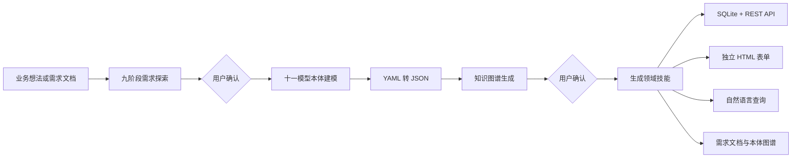

# WorkBuddy App Builder Skill

[简体中文](README.md) | [English](README_EN.md)

一个面向 WorkBuddy 的本体驱动应用构建技能。它从一段业务想法或需求文档出发，通过多轮需求探索和人工确认，建立十一类领域本体模型，并生成一个可安装、可运行、自包含的新领域技能。

生成的领域技能不是只有一组提示词。它同时包含完整需求文档、本体 YAML/JSON、SQLite 数据库运行引擎、REST API、对象录入表单、自然语言查询能力和离线知识图谱。

> 技能内部名称为 `ontology-app-builder`。安装时请使用这个目录名，因为当前技能说明中的工具路径以 `~/.workbuddy/skills/ontology-app-builder/` 为基准。

## 它解决什么问题

传统的业务应用建设通常需要依次完成需求访谈、领域分析、数据建模、接口设计、表单开发、数据库开发和查询开发。本项目把这些工作组织成一条由 WorkBuddy 执行、由用户在关键节点确认的生成流水线：



核心目标是让业务判断保持可追溯、可确认，同时让最终产物可以直接运行，而不是停留在需求文档或模型文件阶段。

## 核心能力

- **交互式需求探索**：严格按九个阶段逐步澄清范围、对象、功能、规则、事件、流程、报表、角色、接口和可选 UI 原型。
- **人工确认门禁**：所有需要业务判断的内容都会停下来确认；需求未清零前不生成本体，模型未确认前不生成领域技能。
- **十一模型建模**：生成 M1~M7、ME、MU、MM、MI 十一类标准 YAML 模型。
- **自包含领域技能**：将需求文档、本体、运行引擎、表单和知识图谱打包到新的 WorkBuddy 技能目录。
- **本体驱动建库**：运行时读取 M1 JSON，自动创建 SQLite 主表、子表和数据字典表。
- **通用 CRUD API**：按聚合根提供新增、列表、按 ID 修改和删除/作废能力。
- **独立录入表单**：为每个聚合根生成独立 HTML，支持数据字典、对象引用、枚举、自动编号和一层主从明细。
- **自然语言查询**：WorkBuddy 根据模型元数据把自然语言转换成只读 SQL，再通过本地 API 执行。
- **离线知识图谱**：将本体节点和关系输出为自包含 ECharts HTML，无需联网即可查看。
- **零第三方运行时依赖**：生成后的领域技能只使用 Python 标准库和内置 SQLite。

## 十一模型

| 模型 | 文件 | 作用 |
| --- | --- | --- |
| M1 对象模型 | `m1-object-model.yaml` | 聚合根、子实体、值对象、属性、数据字典、关联、不变量；当前运行时建库的权威来源 |
| M2 行为模型 | `m2-behavior-model.yaml` | 对象原子行为和查询行为 |
| M3 规则模型 | `m3-rule-model.yaml` | 跨对象、事件驱动或可复用规则 |
| ME 事件模型 | `me-event-model.yaml` | 领域事件、生产者、订阅者和载荷 |
| M4 场景模型 | `m4-scenario-model.yaml` | 跨对象事件协同场景 |
| M5 主体模型 | `m5-actor-model.yaml` | 参与者、角色和权限 |
| M6 流程模型 | `m6-flow-model.yaml` | 端到端协同流和可选审批流 |
| M7 查询报表模型 | `m7-report-model.yaml` | 查询、统计、固定报表和参考 SQL |
| MU UI 模型 | `mu-ui-model.yaml` | 屏幕、元素、导航、UI 事件和调用链 |
| MM 映射模型 | `m-mapping-model.yaml` | 对象、表、列和外键的显式映射 |
| MI 接口模型 | `mi-interface-model.yaml` | 对外提供或依赖的接口契约 |

当前 v1 运行引擎只消费 M1~M7+ME 八类 JSON；MU、MM、MI 会作为标准建模成果一并交付，但不参与当前引擎的建库、CRUD 和查询。数据库表名与列名以 M1 中的英文 `alias`/属性 `name` 为准，M7 的 `referenceSql` 只提供业务口径参考。

## 工作流程

### 第一阶段：需求探索

技能首先完整读取 `specs/AI需求探索与确认提示词V4.0.md`，按以下阶段与用户交互：

1. 原始需求接收与总体理解确认
2. 业务对象探索
3. 业务功能与规则探索
4. 事件识别与跨对象影响分析
5. 跨对象事件协同场景探索
6. 端到端协同流与审批流探索
7. 查询统计与固定报表探索
8. 岗位角色与功能权限探索
9. 接口需求探索与确认
10. 可选 UI 原型探索与确认

规范名称中的“九阶段”沿用原文口径，即阶段零到阶段九。

每批通常提出 3~6 个问题。每个问题都会给出 AI 建议、理由和备选方案，用户可以直接回复“按 AI 建议”。结论持续写入需求文档，并标记为 `[AI自动补全]`、`[已确认]` 或 `[待确认]`。

阶段完成后，需求文档写入：

```text
<工作区>/.workbuddy/ontology/<项目名>/需求文档.md
```

只有待确认项清零且用户明确同意后，才进入本体建模。

### 第二阶段：本体建模

技能依据 `specs/ontology_modeling_framework_v6.md` 和 `specs/UI布局规范.txt` 生成十一模型 YAML、JSON 伴生文件与 `manifest.json`：

```text
<工作区>/.workbuddy/ontology/<项目名>/
├── 需求文档.md
├── knowledge-graph-data.json
├── 知识图谱.html
└── yaml/
    ├── m1-object-model.yaml / .json
    ├── m2-behavior-model.yaml / .json
    ├── m3-rule-model.yaml / .json
    ├── me-event-model.yaml / .json
    ├── m4-scenario-model.yaml / .json
    ├── m5-actor-model.yaml / .json
    ├── m6-flow-model.yaml / .json
    ├── m7-report-model.yaml / .json
    ├── mu-ui-model.yaml / .json
    ├── m-mapping-model.yaml / .json
    ├── mi-interface-model.yaml / .json
    └── manifest.json
```

YAML 用于阅读和维护，JSON 用于保证生成技能在运行阶段不依赖 PyYAML。模型生成后，技能自动构建知识图谱，并再次等待用户确认。

### 第三阶段：领域技能生成

确认后，技能在以下位置创建新的领域技能：

```text
~/.workbuddy/skills/<domain-slug>/
├── SKILL.md
├── 需求文档.md
├── 知识图谱.html
├── knowledge-graph-data.json
├── engine/
├── forms/
│   └── <AggregateAlias>_form.html
├── ont_yaml/
│   ├── *.yaml
│   ├── *.json
│   └── manifest.json
└── data/
    └── app.db                 # 首次启动时生成
```

随后会进行最小自测：启动引擎、录入主数据、录入包含子实体的核心对象，并执行至少一条查询验证外键名称解析。

## 安装

### 前置条件

- 已安装并可使用 WorkBuddy。
- WorkBuddy 支持本地技能目录 `~/.workbuddy/skills/`。
- 可用的 Python 3 解释器。
- 构建阶段需要 [PyYAML](https://pyyaml.org/)；生成后的领域技能运行时不需要第三方 Python 包。

优先使用 WorkBuddy 托管的 Python：

```text
~/.workbuddy/binaries/python/envs/default/Scripts/python.exe
```

如果该解释器不存在，可以使用系统 `python` 或 `python3`，并安装 PyYAML：

```bash
python -m pip install pyyaml
```

### 安装到 WorkBuddy

克隆仓库后，把本目录复制为 `ontology-app-builder`：

PowerShell：

```powershell
$target = Join-Path $HOME ".workbuddy\skills\ontology-app-builder"
New-Item -ItemType Directory -Force -Path $target | Out-Null
Copy-Item -Recurse -Force ".\WorkBuddy-AppBuilderSkill\*" $target
```

Bash：

```bash
mkdir -p ~/.workbuddy/skills/ontology-app-builder
cp -R ./WorkBuddy-AppBuilderSkill/. ~/.workbuddy/skills/ontology-app-builder/
```

重新加载 WorkBuddy 技能列表，并确认 `ontology-app-builder` 已启用。

## 快速开始

在 WorkBuddy 对话中提出业务需求即可。以下表达都可以触发本技能：

```text
帮我构建一个供应商准入与绩效管理应用。
```

```text
把这份合同管理需求转换成本体应用，并生成可安装的领域技能。
```

```text
使用 ontology app builder 为设备巡检业务建模。
```

技能不会立即跳到代码生成。它会先复述业务理解，然后逐阶段提出需要确认的问题。推荐按实际情况回答，也可以在建议合理时回复：

```text
按 AI 建议。
```

在两个阶段门禁处，需要明确回复是否继续：

```text
进入本体建模。
```

```text
生成领域技能。
```

生成完成后，可在 WorkBuddy 中调用新技能：

```text
打开供应商录入界面。
查询所有处于合格状态的供应商，按最近考核得分降序排列。
打开供应商管理知识图谱。
```

## 运行生成的领域技能

通常 WorkBuddy 会按新技能的 `SKILL.md` 自动启动引擎。也可以在领域技能根目录手动运行：

```bash
python engine/run.py --port 8990
```

引擎启动后默认监听：

```text
http://127.0.0.1:8990
```

启动过程会：

1. 从 `ont_yaml/manifest.json` 和模型 JSON 加载本体。
2. 在 `data/app.db` 创建或复用 SQLite 数据库。
3. 同步 M1 数据字典到内部表 `__dict`。
4. 按 M1 聚合根和子实体创建业务表。
5. 启动内置 HTML 页面和 REST API。

## REST API

引擎使用 Python 标准库 `http.server` 提供本地接口，并为独立 HTML 表单启用 CORS。

| 方法 | 路径 | 说明 |
| --- | --- | --- |
| `GET` | `/` | 领域对象首页 |
| `GET` | `/entry/<alias>` | 引擎内置录入页 |
| `GET` | `/detail/<alias>/<id>` | 对象详情页 |
| `GET` | `/query` | 只读 SQL 查询控制台 |
| `GET` | `/api/schema` | 表、列、外键、字典和报表元数据 |
| `GET` | `/api/objects/<alias>` | 对象列表，外键和字典附带 `__label` 字段 |
| `POST` | `/api/objects/<alias>` | 新增对象，可携带一层子实体数组 |
| `PUT` | `/api/objects/<alias>/<id>` | 按 ID 修改对象 |
| `DELETE` | `/api/objects/<alias>/<id>` | 逻辑作废或受引用保护的物理删除 |
| `POST` | `/api/sql` | 执行单条只读 `SELECT` |

新增示例：

```bash
curl -X POST http://127.0.0.1:8990/api/objects/Supplier \
  -H "Content-Type: application/json" \
  -d '{"supplierName":"示例供应商","status":"合格"}'
```

只读查询示例：

```bash
curl -X POST http://127.0.0.1:8990/api/sql \
  -H "Content-Type: application/json" \
  -d '{"sql":"SELECT * FROM Supplier ORDER BY supplierName"}'
```

`/api/sql` 只接受以 `SELECT` 开始的单条语句，并拒绝写操作、DDL、PRAGMA、注释和多语句分隔符。

## 数据映射与运行语义

| 本体结构 | SQLite 表示 |
| --- | --- |
| 聚合根 | 以聚合根 `alias` 命名的主表 |
| 集合型子实体 | `<聚合根alias>_<子实体alias>` 子表 |
| 单值子实体 | 平铺为主表列 |
| 值对象 | JSON 字符串，存入 `TEXT` 列 |
| `AggregateRootRef` | 目标聚合根 ID，存入 `TEXT` 列 |
| `DictionaryRef` | 字典项 code，存入 `TEXT` 列 |
| `Enum` / `Date` / `DateTime` | `TEXT` |
| `Boolean` | `INTEGER`，值为 0/1 |
| `Integer` | `INTEGER` |
| `Decimal` / `Money` | `REAL` |

运行引擎还会自动处理：

- 为每张聚合根表补充 `createdBy`、`createdAt`、`updatedBy`、`updatedAt`。
- 默认操作人为 `admin`。
- 未传主键时，按对象 alias 前三位大写加四位流水号生成，例如 `SUP0001`。
- 执行属性 `refRules` 和部分对象不变量校验。
- 查询对象时将外键 ID 和字典 code 补充为 `<字段名>__label`。
- 若生命周期包含“作废/已作废”等状态，默认删除会改为逻辑作废；否则在没有下游引用时执行物理删除。

## 独立 HTML 表单

领域技能会为 M1 中每个聚合根生成 `forms/<Alias>_form.html`。这些表单用于 WorkBuddy 右侧面板预览，并直接调用本地引擎 API。

字段渲染规则：

- 数据字典字段从 `GET /api/schema` 动态加载。
- 聚合根引用从 `GET /api/objects/<目标alias>` 动态加载。
- 枚举字段生成为静态下拉框。
- 编号字段显示为只读，由引擎生成。
- 系统字段不显示。
- 单对象使用两列网格。
- 主从对象使用“上部主表表单 + 下部明细表”，当前支持一层子实体。
- 表单通过注入的绝对 `API_BASE` 连接启动后的本地端口。

## 自然语言查询如何工作

自然语言不是由 HTTP 引擎直接解析。实际链路如下：

1. WorkBuddy 调用 `GET /api/schema` 获取表、列、外键、字典和报表信息。
2. 模型根据用户问题生成只读 `SELECT`。
3. WorkBuddy 把 SQL 提交给 `POST /api/sql`。
4. 引擎校验并执行 SQL，将结果返回给 WorkBuddy。
5. WorkBuddy 将结果整理为表格或自然语言答案。

因此，表名和字段名必须来自 `/api/schema`，不能根据中文名称猜测。M7 `referenceSql` 可以作为查询口径参考，但不是数据库结构的唯一来源。

## 知识图谱

构建阶段先由 `tools/build_knowledge_graph.py` 解析 YAML，生成 `knowledge-graph-data.json`，再由 `tools/build_graph_html.py` 将图谱数据、模板和 `echarts.min.js` 合并成完全离线的 `知识图谱.html`。

当前图谱生成器实际解析 M1~M7+ME 八类模型，可展示聚合根、子实体、值对象、字典、行为、规则、事件、场景、角色、权限、流程和报表，以及它们之间的包含、引用、调用、生产、订阅和授权关系。MU、MM、MI 文件会被生成和打包，但当前版本尚未加入图谱解析器。

手动重新生成：

```bash
python tools/build_knowledge_graph.py <ont_yaml_dir> knowledge-graph-data.json
python tools/build_graph_html.py \
  knowledge-graph-data.json \
  tools/echarts.min.js \
  知识图谱.html \
  "领域名称·本体知识图谱"
```

## 项目结构

```text
WorkBuddy-AppBuilderSkill/
├── SKILL.md                         # 构建器技能主流程和强制约束
├── README.md                        # 项目说明
├── engine/
│   ├── run.py                       # 领域技能运行入口
│   ├── loader.py                    # manifest 和模型 JSON 加载
│   ├── db.py                        # M1 -> SQLite 建库
│   ├── crud.py                      # 校验、CRUD、主从保存、删除语义
│   ├── query.py                     # schema、只读 SQL、外键/字典增强
│   ├── server.py                    # 内置页面与 REST API
│   ├── yaml2json.py                 # 构建期 YAML -> JSON
│   └── requirements.txt             # 依赖说明
├── scaffold/
│   └── SKILL.md.template.md         # 新领域技能的说明模板
├── specs/
│   ├── AI需求探索与确认提示词V4.0.md # 当前需求探索规范
│   ├── ontology_modeling_framework_v6.md # 当前十一模型规范
│   ├── UI布局规范.txt                # 表单布局约束
│   └── ...                           # 旧版本规范，供历史参考
└── tools/
    ├── build_knowledge_graph.py      # YAML -> 图谱 JSON
    ├── build_graph_html.py           # 图谱 JSON -> 离线 HTML
    ├── knowledge-graph-template.html # 图谱模板
    ├── echarts.min.js                # 离线 ECharts
    └── generate_ui_workbench.py      # 已停用的旧 UI 工作台生成器
```

当前权威规范是 V4.0 需求探索文档和 v6 本体建模框架。V3.0 及无版本后缀的旧文档仅保留用于历史对照。

## 当前边界

本项目当前定位为本地单用户 MVP，使用前应了解以下边界：

- 运行时没有登录、租户隔离和权限拦截；M5 权限当前属于模型成果。
- M3 事件总线和 M6 审批流可以建模，但当前通用引擎不会执行事件编排或审批。
- MU、MM、MI 不参与当前运行时建库与查询。
- 知识图谱当前只解析 M1~M7+ME，不解析 MU、MM、MI。
- 主从录入只支持一层集合型子实体，值对象以 JSON 文本保存。
- 不变量执行器只支持有限表达式；无法识别的表达式会返回警告而不会阻止保存。
- 数据库使用 `CREATE TABLE IF NOT EXISTS` 幂等初始化，不包含正式的 schema migration 机制。模型结构发生变化时应先备份数据并设计迁移方案。
- SQLite 外键约束未在数据库层启用，引用保护由 CRUD 逻辑实现。
- HTTP 服务默认只监听 `127.0.0.1`，没有身份认证，不应直接暴露到公网。
- `/api/sql` 提供基础只读保护，但它不是面向不受信任公网用户的 SQL 沙箱。
- 表单文件由 WorkBuddy 按技能规范生成，不是由仓库中的独立确定性 CLI 批量生成器生成。

## 排错

### 技能没有被识别

确认安装目录和主文件为：

```text
~/.workbuddy/skills/ontology-app-builder/SKILL.md
```

并重新加载或重启 WorkBuddy。

### 提示缺少 PyYAML

PyYAML 仅用于 YAML 转 JSON 和知识图谱构建：

```bash
python -m pip install pyyaml
```

### 引擎提示找不到本体

生成的领域技能必须包含：

```text
ont_yaml/manifest.json
ont_yaml/m1-object-model.json
```

如果只修改了 YAML，需要重新生成 JSON：

```bash
python engine/yaml2json.py ont_yaml
```

### 端口被占用

改用其他端口启动，并确保独立表单中的 `API_BASE` 使用同一端口：

```bash
python engine/run.py --port 8991
```

### 模型更新后数据库没有新增列

当前建库逻辑不会自动迁移已存在的表。请先备份 `data/app.db`，再采用显式迁移脚本；开发测试数据可在确认不需要保留后重建数据库。

## 开发与验证

运行 Python 语法检查：

```bash
python -m compileall -q engine tools
```

修改建模规范或运行引擎时，建议至少验证以下路径：

1. YAML 能成功转换为 JSON。
2. `manifest.json` 能正确定位八类运行时模型。
3. 引擎首次启动能自动建库。
4. 普通聚合根和一层主从聚合都能新增、查询和修改。
5. 数据字典和聚合根引用能返回正确的 `__label`。
6. 逻辑作废和下游引用保护符合预期。
7. `/api/sql` 拒绝非 SELECT 语句。
8. 知识图谱 JSON 和离线 HTML 能成功生成。

仓库当前未包含自动化测试套件和端到端示例领域。贡献这两部分会显著提升发布质量和回归可靠性。

## 贡献

欢迎通过 Issue 或 Pull Request 改进需求探索规范、本体元模型、运行引擎、表单体验和图谱能力。提交前请保持以下原则：

- 不绕过需求探索和两次人工确认门禁。
- 不机械复用示例业务内容。
- 保持 M1 表名/列名口径与运行引擎一致。
- 区分“建模成果”和“当前运行时已执行的能力”。
- 对共享模型结构或 CRUD 行为的修改补充相应测试。
- 不提交运行生成的 `data/app.db`、临时本体输出或 `__pycache__`。

## 许可证

本项目采用 [MIT License](LICENSE) 开源。
