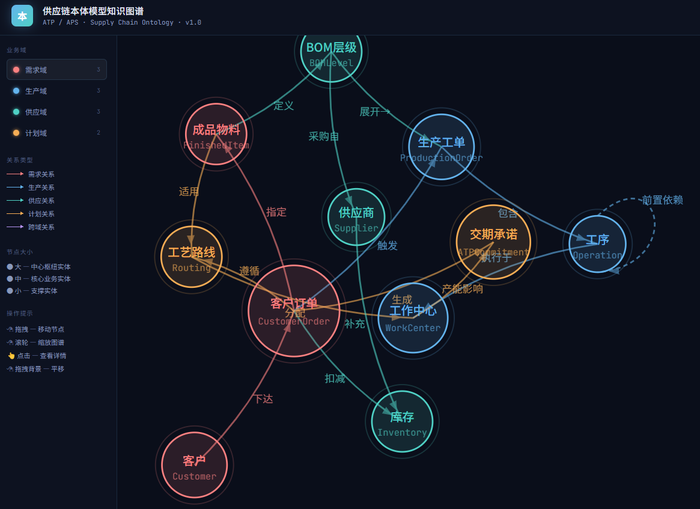

# Onto-SupplyChain

[中文](#中文) | [English](#english)

## 中文

Onto-SupplyChain 是一个面向制造业供应链的本体驱动 ATP（Available to Promise，可承诺量/交期）分析与推理演示项目。

项目以供应链本体作为业务语义基础，将客户订单、库存、BOM、供应商、工艺路线、生产工单、工序和工作中心等对象连接起来，通过结构化规则完成 ATP 计算，再由大模型将计算结果转换为可追溯的业务解释。

> 当前版本聚焦 ATP 交期承诺的最小可运行闭环，不是完整的生产级 APS，也暂不包含多工厂全局优化、MILP/CP-SAT 求解器或真实 SAP/MES 集成。

## 系统界面



界面以供应链本体知识图谱为核心，展示需求、生产、供应和计划四个业务域中的实体及关系，并支持场景触发、推理过程查看和 ATP 结果解释。

## 核心能力

- **供应链本体建模**：以业务实体、关系、约束和事件描述供应链语义
- **ATP 交期分析**：综合判断库存覆盖、BOM 缺口、物料齐套、供应风险和产能负荷
- **场景驱动推理**：针对订单插单、需求变更、物料延迟和产能瓶颈执行统一推理链
- **可解释结果**：输出承诺日期、置信度、风险等级、原因链、影响对象和备选方案
- **本体知识图谱**：通过 D3 力导向图展示供应链对象与关系
- **可选 LLM 解释**：可接入 DeepSeek；未配置 API key 时使用本地规则解释
- **内置演示数据**：仓库已包含 SQLite 模拟数据库，可直接运行四个预设场景

## 本体模型

本体模型以 `CustomerOrder`（客户订单）为中心，覆盖四个业务域：

| 业务域 | 核心问题 | 主要实体 |
| --- | --- | --- |
| 需求域 | 谁需要什么、需要多少、何时交付 | `Customer`、`CustomerOrder`、`FinishedItem` |
| 生产域 | 使用哪些资源、如何生产、当前进度如何 | `WorkCenter`、`ProductionOrder`、`Operation` |
| 供应域 | 物料来自哪里、库存多少、何时齐套 | `Inventory`、`BOMLevel`、`Supplier` |
| 计划域 | 采用什么路径、何时能够完成和承诺 | `Routing`、`ATPCommitment` |

数据库负责保存结构化事实，本体模型负责表达这些事实的业务含义及关系。例如，数据库外键只能说明工单关联工作中心，而本体关系能够进一步表达“工单在工作中心执行”，从而支持产能不足对交期影响的推理。

详细设计见 [供应链本体模型设计详细说明](docs/供应链本体模型设计详细说明.md)。

## 推理流程

四个预设场景共享同一套 ATP 推理骨架：

1. 识别场景关联的订单、客户和成品对象
2. 装载库存、BOM、供应商、工艺路线和工作中心数据
3. 判断成品库存能够直接覆盖的需求数量
4. 展开 BOM，识别组件缺口、在途物料和可用替代料
5. 根据工作中心日历、现有负荷和工序依赖推演最早完工时间
6. 应用物料延迟、需求变化或产能瓶颈等场景修正
7. 比较标准生产、加班、替代料和替代路线等候选方案
8. 输出 ATP 承诺结果、原因链、影响对象、风险和业务解释

大模型不负责重新计算 ATP 数值，只基于后端生成的结构化结果进行业务化表达。即使没有配置大模型，核心 ATP 分析仍可独立运行。

完整流程见 [场景触发 AI 推理过程说明](docs/场景触发AI推理过程说明.md)。

## 演示场景

| 场景 | 示例问题 | 主要分析内容 |
| --- | --- | --- |
| 客户加急插单 | VIP 客户临时插单，最早什么时候能交？ | 成品库存、插单窗口、瓶颈产能、既有订单影响 |
| 需求数量上调 | 订单数量增加后，原交期能否维持？ | 追加库存消耗、BOM 缺口、工序时间和产能覆盖 |
| 关键物料延迟 | 核心物料延期到货，订单能否按期交付？ | 可用库存、在途时间、替代料和供应风险 |
| 产能瓶颈 | 关键工作中心产能爆满，承诺日期是否变化？ | 工作中心负荷、工序依赖、加班和替代路线 |

## 技术架构



| 层级 | 技术与职责 |
| --- | --- |
| 前端 | React、TypeScript、Vite、D3；图谱、场景、对话和推理结果展示 |
| 后端 | Python、Flask；REST API、场景编排和 ATP 规则计算 |
| 数据 | SQLite；订单、库存、BOM、供应商、工艺和演示场景数据 |
| 大模型 | DeepSeek API（可选）；结构化结果解释和多方案表达 |

## 项目结构

```text
Onto-SupplyChain/
├── backend/
│   ├── data/atp_demo.sqlite3      # 已构建的模拟数据库
│   ├── db/                        # 数据库连接与 Schema
│   ├── scripts/seed_demo_data.py  # 演示数据生成脚本
│   ├── services/atp/              # ATP 推理引擎
│   ├── services/llm/              # DeepSeek 客户端与本地回退
│   ├── config.example.json        # 配置示例，不包含密钥
│   └── app.py                     # Flask API 入口
├── frontend/
│   └── src/                       # React 页面、图谱和结果组件
├── docs/                          # 设计文档、流程图和系统截图
├── start_demo.ps1                 # Windows 一键启动脚本
└── README.md
```

项目不包含 `node_modules`、前端构建产物、本地配置或真实 API key，依赖需要通过清单安装。

## 环境要求

- Python 3.10+
- Node.js 18+
- npm

## 快速开始

以下命令适用于 Windows PowerShell：

```powershell
Set-Location .\Onto-SupplyChain

# 安装后端依赖
python -m pip install -r backend\requirements.txt

# 安装前端依赖
Set-Location frontend
npm install
Set-Location ..

# 使用仓库内已有的演示数据库启动
.\start_demo.ps1
```

启动后访问：

- 前端：<http://127.0.0.1:5173>
- 后端健康检查：<http://127.0.0.1:5000/api/health>

启动脚本默认不会覆盖现有数据库。如需重新生成演示数据：

```powershell
.\start_demo.ps1 -Seed
```

## 手动启动

后端：

```powershell
Set-Location backend
python app.py
```

前端：

```powershell
Set-Location frontend
npm run dev
```

## DeepSeek 配置

默认不需要 API key。未配置时，系统使用本地规则生成解释，但 ATP 计算、推理链和场景演示仍可正常运行。

需要接入 DeepSeek 时：

1. 将 `backend/config.example.json` 复制为 `backend/config.local.json`。
2. 在本地配置文件中填写 `DEEPSEEK_API_KEY`。
3. 按需调整模型名称、API 地址、超时和温度参数。

也可以使用环境变量，环境变量优先于本地配置文件：

```powershell
$env:DEEPSEEK_API_KEY = "your-api-key"
$env:DEEPSEEK_MODEL = "deepseek-chat"
```

`backend/config.local.json` 已加入 `.gitignore`，请勿提交真实密钥。

## 数据库与部署配置

默认数据库为 `backend/data/atp_demo.sqlite3`，项目不依赖原始开发目录或其他外部数据文件。

如需替换数据库，可以设置 `ATP_DATABASE_PATH`。相对路径会相对于 `backend/` 目录解析：

```powershell
$env:ATP_DATABASE_PATH = "data/atp_demo.sqlite3"
```

前端默认请求 `http://127.0.0.1:5000/api`。部署到其他地址时可设置：

```powershell
$env:VITE_API_BASE_URL = "http://127.0.0.1:5000/api"
```

## 设计文档

- [供应链本体模型设计详细说明](docs/供应链本体模型设计详细说明.md)
- [场景触发 AI 推理过程说明](docs/场景触发AI推理过程说明.md)
- [ATP 最小可运行演示应用设计方案](docs/ATP最小可运行演示应用设计方案.md)
- [AI 驱动供应链智能计划排产与交期承诺技术方案](docs/AI驱动供应链智能计划排产与交期承诺技术方案.md)
- [关键物料短缺场景推理流程](docs/关键物料短缺场景推理流程.mmd)
- [供应链本体模型知识图谱（HTML）](docs/供应链本体模型知识图谱.html)

`docs/` 目录还包含技术架构、系统集成、数据蒸馏、Prompt 结构和时序设计等 SVG 图示。

## 许可证

本项目采用 [MIT License](LICENSE) 授权。你可以自由使用、复制、修改、合并、发布和再许可本项目，但须保留版权声明和许可证声明。项目按“现状”提供，不承担任何明示或默示保证。

---

## English

Onto-SupplyChain is an ontology-driven supply-chain ATP (Available to Promise) analysis and reasoning demo for manufacturing scenarios.

The project uses a supply-chain ontology as its semantic layer. It connects customers, customer orders, finished items, inventory, BOM levels, suppliers, routings, production orders, operations, work centers, and ATP commitments. Deterministic backend rules calculate feasible commitments, while an optional LLM turns the structured result into a traceable business explanation.

> The current release focuses on a runnable ATP delivery-commitment loop. It is not a full production APS implementation and does not include global multi-factory optimization, MILP/CP-SAT solvers, or live SAP/MES integration.

### Features

- Ontology modeling across demand, production, supply, and planning domains
- ATP analysis for inventory coverage, BOM shortages, material readiness, supplier risk, and capacity
- Four database-backed demo scenarios: rush insertion, demand increase, material delay, and capacity bottleneck
- Explainable results with commitment date, confidence, risk, reason chain, impact objects, and alternatives
- Interactive D3 ontology graph with React/TypeScript UI
- Optional DeepSeek explanation; local fallback mode works without an API key
- Bundled SQLite demo database with pre-built sample data

### System UI


The UI combines the ontology graph, scenario controls, reasoning trace, ATP results, and conversational follow-up in one demonstration workflow.

### Architecture


- **Frontend:** React, TypeScript, Vite, and D3
- **Backend:** Python and Flask REST APIs
- **Data:** SQLite demo database
- **LLM:** Optional DeepSeek API for explanation generation

### Quick Start

Requirements: Python 3.10+, Node.js 18+, and npm.

```powershell
Set-Location .\Onto-SupplyChain
python -m pip install -r backend\requirements.txt
Set-Location frontend
npm install
Set-Location ..
.\start_demo.ps1
```

Open <http://127.0.0.1:5173> after startup. The backend health endpoint is <http://127.0.0.1:5000/api/health>.

The startup script uses the bundled database and does not overwrite it. To regenerate demo data explicitly:

```powershell
.\start_demo.ps1 -Seed
```

### DeepSeek Configuration

LLM configuration is optional. Without an API key, ATP calculations and the local fallback explanation remain available.

1. Copy `backend/config.example.json` to `backend/config.local.json`.
2. Set `DEEPSEEK_API_KEY` in the local file, or set it as an environment variable.
3. Adjust `DEEPSEEK_MODEL`, `DEEPSEEK_BASE_URL`, timeout, and temperature if needed.

Environment variables take precedence over the local configuration file. `backend/config.local.json` is ignored by Git and must never contain a committed production secret.

```powershell
$env:DEEPSEEK_API_KEY = "your-api-key"
$env:DEEPSEEK_MODEL = "deepseek-chat"
```

To point the frontend at another backend URL, set `VITE_API_BASE_URL`, for example:

```powershell
$env:VITE_API_BASE_URL = "http://127.0.0.1:5000/api"
```

### Documentation

- [Supply-chain ontology model design](docs/供应链本体模型设计详细说明.md)
- [Scenario-triggered AI reasoning flow](docs/场景触发AI推理过程说明.md)
- [Minimal runnable ATP demo design](docs/ATP最小可运行演示应用设计方案.md)
- [AI-driven planning and delivery commitment proposal](docs/AI驱动供应链智能计划排产与交期承诺技术方案.md)
- [Material-shortage reasoning flow](docs/关键物料短缺场景推理流程.mmd)
- [Interactive ontology graph HTML](docs/供应链本体模型知识图谱.html)

### License

This project is released under the [MIT License](LICENSE). You may use, copy, modify, merge, publish, distribute, sublicense, and sell copies of the software, provided that the copyright and permission notices are preserved. The software is provided “as is”, without warranty of any kind.
