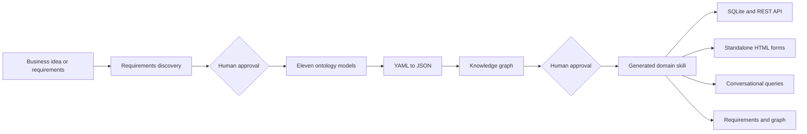

# WorkBuddy App Builder Skill

[简体中文](README.md) | [English](README_EN.md)

An ontology-driven application builder skill for WorkBuddy. Starting from a short business idea or an existing requirements document, it guides the user through structured requirements discovery, builds eleven domain ontology models, and generates a new self-contained WorkBuddy domain skill that can run locally.

The generated skill is more than a prompt package. It contains the confirmed requirements, ontology YAML and JSON, a SQLite runtime engine, REST APIs, standalone data-entry forms, conversational query instructions, and an offline knowledge graph.

> The internal skill name is `ontology-app-builder`. Install it under this directory name because the current workflow resolves its tools from `~/.workbuddy/skills/ontology-app-builder/`.

## Why This Project Exists

Building a business application normally requires requirements interviews, domain analysis, data modeling, interface design, form development, database work, and query development. This project organizes those activities into a WorkBuddy-driven workflow with explicit human approval at every business decision boundary.



The goal is to keep business decisions explicit, reviewable, and traceable while producing an application artifact that can actually run.

## Features

- **Interactive requirements discovery** covering scope, objects, functions, rules, events, processes, reports, roles, interfaces, and optional UI prototypes.
- **Human approval gates** that prevent ontology generation before requirements are confirmed and prevent skill packaging before the ontology is reviewed.
- **Eleven-model ontology output** covering M1-M7, ME, MU, MM, and MI.
- **Self-contained generated skills** containing requirements, ontology files, runtime code, forms, and a knowledge graph.
- **Ontology-driven SQLite creation** based on the M1 object model.
- **Generic CRUD APIs** for aggregate roots, including one-level master-detail input.
- **Standalone HTML forms** with dictionaries, aggregate references, enums, automatic identifiers, and system-field handling.
- **Conversational queries** in which WorkBuddy translates user questions into read-only SQL using ontology-derived schema metadata.
- **Offline knowledge graph** exported as a self-contained ECharts HTML file.
- **Zero third-party runtime dependencies** in generated domain skills. Only the Python standard library and SQLite are used at runtime.

## The Eleven Models

| Model | File | Purpose |
| --- | --- | --- |
| M1 Object | `m1-object-model.yaml` | Aggregates, entities, value objects, attributes, dictionaries, associations, and invariants; the authoritative database source for the current runtime |
| M2 Behavior | `m2-behavior-model.yaml` | Atomic object behaviors and query behaviors |
| M3 Rule | `m3-rule-model.yaml` | Cross-object, event-driven, or reusable rules |
| ME Event | `me-event-model.yaml` | Domain events, producers, subscribers, and payloads |
| M4 Scenario | `m4-scenario-model.yaml` | Cross-object event collaboration scenarios |
| M5 Actor | `m5-actor-model.yaml` | Actors, roles, and permissions |
| M6 Flow | `m6-flow-model.yaml` | End-to-end collaboration and optional approval flows |
| M7 Report | `m7-report-model.yaml` | Queries, statistics, fixed reports, and reference SQL |
| MU UI | `mu-ui-model.yaml` | Screens, elements, navigation, UI events, and call chains |
| MM Mapping | `m-mapping-model.yaml` | Object-to-table, column, and foreign-key mappings |
| MI Interface | `mi-interface-model.yaml` | Provided and required interface contracts |

The current v1 runtime loads the eight M1-M7+ME JSON models. MU, MM, and MI are generated and packaged as standard modeling deliverables, but they do not currently drive database creation, CRUD, or querying. Runtime table and column names come from M1 English aliases and attribute names. M7 `referenceSql` is a business reference, not the sole database definition.

## Workflow

### Stage 1: Requirements Discovery

The builder reads `specs/AI需求探索与确认提示词V4.0.md` and follows stages zero through nine:

1. Receive the original request and confirm the overall understanding.
2. Discover business objects.
3. Discover functions and business rules.
4. Identify events and cross-object effects.
5. Discover cross-object event collaboration scenarios.
6. Discover end-to-end collaboration and approval flows.
7. Discover queries, statistics, and fixed reports.
8. Discover roles and functional permissions.
9. Discover and confirm interface requirements.
10. Optionally discover and confirm UI prototypes.

The source specification calls this a nine-stage process while numbering it from stage zero to stage nine.

Questions are asked in batches of three to six. Every question includes a recommended answer, rationale, and alternatives, so the user can reply with the equivalent of "use the AI recommendation." Conclusions are written into the evolving requirements document and marked as AI-completed, confirmed, or pending.

The requirements document is saved to:

```text
<workspace>/.workbuddy/ontology/<project-name>/需求文档.md
```

Ontology modeling cannot begin until all pending decisions are resolved and the user explicitly approves the transition.

### Stage 2: Ontology Modeling

Using `specs/ontology_modeling_framework_v6.md` and `specs/UI布局规范.txt`, the builder creates all eleven YAML models, JSON runtime companions, and `manifest.json`:

```text
<workspace>/.workbuddy/ontology/<project-name>/
├── 需求文档.md
├── knowledge-graph-data.json
├── 知识图谱.html
└── yaml/
    ├── m1-object-model.yaml / .json
    ├── m2-behavior-model.yaml / .json
    ├── m3-rule-model.yaml / .json
    ├── me-event-model.yaml / .json
    ├── m4-scenario-model.yaml / .json
    ├── m5-actor-model.yaml / .json
    ├── m6-flow-model.yaml / .json
    ├── m7-report-model.yaml / .json
    ├── mu-ui-model.yaml / .json
    ├── m-mapping-model.yaml / .json
    ├── mi-interface-model.yaml / .json
    └── manifest.json
```

YAML remains human-readable and maintainable. JSON companions allow the generated runtime to avoid a PyYAML dependency. The builder then creates the knowledge graph and waits for the second user approval.

### Stage 3: Domain Skill Generation

After approval, the builder installs a new skill at:

```text
~/.workbuddy/skills/<domain-slug>/
├── SKILL.md
├── 需求文档.md
├── 知识图谱.html
├── knowledge-graph-data.json
├── engine/
├── forms/
│   └── <AggregateAlias>_form.html
├── ont_yaml/
│   ├── *.yaml
│   ├── *.json
│   └── manifest.json
└── data/
    └── app.db                 # Created on first start
```

The workflow then performs a minimum smoke test: start the engine, insert master data, insert a core aggregate with child entities, and run a query that verifies foreign-key label resolution.

## Installation

### Prerequisites

- A working WorkBuddy installation.
- Support for local skills under `~/.workbuddy/skills/`.
- A Python 3 interpreter.
- [PyYAML](https://pyyaml.org/) during the build process. Generated domain skills do not need third-party Python packages at runtime.

The preferred interpreter is the WorkBuddy-managed Python environment:

```text
~/.workbuddy/binaries/python/envs/default/Scripts/python.exe
```

If it is unavailable, use `python` or `python3` and install PyYAML:

```bash
python -m pip install pyyaml
```

### Install the Skill

PowerShell:

```powershell
$target = Join-Path $HOME ".workbuddy\skills\ontology-app-builder"
New-Item -ItemType Directory -Force -Path $target | Out-Null
Copy-Item -Recurse -Force ".\WorkBuddy-AppBuilderSkill\*" $target
```

Bash:

```bash
mkdir -p ~/.workbuddy/skills/ontology-app-builder
cp -R ./WorkBuddy-AppBuilderSkill/. ~/.workbuddy/skills/ontology-app-builder/
```

Reload the WorkBuddy skill list and enable `ontology-app-builder`.

## Quick Start

Start with a business request in WorkBuddy, for example:

```text
Build a supplier onboarding and performance management application.
```

```text
Convert this contract management requirements document into an ontology-driven application and generate an installable domain skill.
```

The skill first confirms its understanding and then explores the requirements. It will not skip directly to code generation. At the two approval gates, explicitly approve ontology modeling and then domain-skill generation.

After generation, invoke the new domain skill with requests such as:

```text
Open the supplier entry form.
List all qualified suppliers ordered by their latest assessment score.
Open the supplier management knowledge graph.
```

## Running a Generated Skill

WorkBuddy normally starts the engine according to the generated `SKILL.md`. It can also be started manually from the generated skill root:

```bash
python engine/run.py --port 8990
```

The default address is:

```text
http://127.0.0.1:8990
```

At startup, the engine:

1. Loads `ont_yaml/manifest.json` and the ontology JSON files.
2. Creates or reuses `data/app.db`.
3. Synchronizes M1 dictionaries into the internal `__dict` table.
4. Creates aggregate and child tables from M1.
5. Starts the embedded HTML pages and REST API.

## REST API

| Method | Path | Description |
| --- | --- | --- |
| `GET` | `/` | Domain object home page |
| `GET` | `/entry/<alias>` | Built-in entry page |
| `GET` | `/detail/<alias>/<id>` | Record details |
| `GET` | `/query` | Read-only SQL console |
| `GET` | `/api/schema` | Table, column, foreign-key, dictionary, and report metadata |
| `GET` | `/api/objects/<alias>` | Object list with foreign-key and dictionary `__label` fields |
| `POST` | `/api/objects/<alias>` | Create an object, optionally with one level of child arrays |
| `PUT` | `/api/objects/<alias>/<id>` | Update an object by ID |
| `DELETE` | `/api/objects/<alias>/<id>` | Logical void or reference-protected physical deletion |
| `POST` | `/api/sql` | Execute one read-only `SELECT` statement |

Create example:

```bash
curl -X POST http://127.0.0.1:8990/api/objects/Supplier \
  -H "Content-Type: application/json" \
  -d '{"supplierName":"Example Supplier","status":"Qualified"}'
```

Query example:

```bash
curl -X POST http://127.0.0.1:8990/api/sql \
  -H "Content-Type: application/json" \
  -d '{"sql":"SELECT * FROM Supplier ORDER BY supplierName"}'
```

`/api/sql` only accepts a single statement beginning with `SELECT`. It rejects writes, DDL, PRAGMA, comments, and multi-statement separators.

## Data Mapping and Runtime Semantics

| Ontology structure | SQLite representation |
| --- | --- |
| Aggregate root | Main table named from the aggregate `alias` |
| Collection child entity | `<aggregate-alias>_<child-alias>` table |
| Single child entity | Flattened main-table columns |
| Value object | JSON string in a `TEXT` column |
| `AggregateRootRef` | Target aggregate ID in a `TEXT` column |
| `DictionaryRef` | Dictionary item code in a `TEXT` column |
| `Enum`, `Date`, `DateTime` | `TEXT` |
| `Boolean` | `INTEGER` using 0/1 |
| `Integer` | `INTEGER` |
| `Decimal`, `Money` | `REAL` |

The runtime also:

- Adds and maintains `createdBy`, `createdAt`, `updatedBy`, and `updatedAt` on aggregate tables.
- Uses `admin` as the default operator.
- Generates missing IDs from the first three uppercase alias characters plus a four-digit sequence, such as `SUP0001`.
- Evaluates attribute `refRules` and a supported subset of object invariants.
- Adds `<field>__label` values for aggregate references and dictionary codes in object API results.
- Uses logical voiding when the lifecycle contains a void state; otherwise physical deletion is allowed only when no downstream reference exists.

## Standalone HTML Forms

The generated skill contains `forms/<Alias>_form.html` for every M1 aggregate root. WorkBuddy opens these files in its side panel, and the forms call the local runtime API directly.

- Dictionaries are loaded from `GET /api/schema`.
- Aggregate references are loaded from `GET /api/objects/<target-alias>`.
- Enums become static select controls.
- Identifier fields are read-only and generated by the engine.
- System fields are hidden.
- Single-object forms use a two-column grid.
- Master-detail forms use a top form and bottom detail table, with one child level supported.
- An absolute `API_BASE` is injected after the engine port is known.

## How Conversational Queries Work

The HTTP engine does not parse natural language itself:

1. WorkBuddy fetches `/api/schema` for tables, columns, foreign keys, dictionaries, and reports.
2. The model translates the user question into a read-only `SELECT`.
3. WorkBuddy submits the SQL to `/api/sql`.
4. The engine validates and executes the query.
5. WorkBuddy presents the result as a table or natural-language answer.

Table and column names must come from `/api/schema`. M7 `referenceSql` can guide business semantics but does not replace the M1-derived schema.

## Knowledge Graph

`tools/build_knowledge_graph.py` parses ontology YAML into `knowledge-graph-data.json`. `tools/build_graph_html.py` combines that data, the HTML template, and `echarts.min.js` into a fully offline `知识图谱.html`.

The current graph builder parses M1-M7+ME. It visualizes aggregates, child entities, value objects, dictionaries, behaviors, rules, events, scenarios, roles, permissions, flows, reports, and their relationships. MU, MM, and MI are generated and packaged but are not yet parsed into graph nodes.

Manual generation:

```bash
python tools/build_knowledge_graph.py <ont_yaml_dir> knowledge-graph-data.json
python tools/build_graph_html.py \
  knowledge-graph-data.json \
  tools/echarts.min.js \
  knowledge-graph.html \
  "Domain Name - Ontology Knowledge Graph"
```

## Repository Layout

```text
WorkBuddy-AppBuilderSkill/
├── SKILL.md
├── README.md
├── README_EN.md
├── LICENSE
├── engine/                         # Generated-skill runtime
├── scaffold/SKILL.md.template.md  # Generated domain-skill template
├── specs/                          # Requirements and ontology standards
└── tools/                          # Graph and legacy UI generators
```

The authoritative specifications are `AI需求探索与确认提示词V4.0.md`, `ontology_modeling_framework_v6.md`, and `UI布局规范.txt`. Older versions are retained for historical comparison only. `tools/generate_ui_workbench.py` belongs to a discontinued UI workbench path and is not part of the current generation flow.

## Current Limitations

- The runtime is a local, single-user MVP with no login, tenant isolation, or permission enforcement.
- M3 event-bus and M6 approval-flow concepts can be modeled but are not executed by the generic runtime.
- MU, MM, and MI do not currently drive runtime database or query behavior.
- The graph builder currently parses only M1-M7+ME.
- Master-detail input supports one collection-child level.
- Unsupported invariant expressions generate warnings instead of blocking writes.
- Database initialization uses `CREATE TABLE IF NOT EXISTS`; formal schema migration is not implemented.
- SQLite foreign-key enforcement is disabled; CRUD logic provides reference protection.
- The unauthenticated HTTP service should remain bound to `127.0.0.1` and must not be exposed directly to the public Internet.
- `/api/sql` provides basic read-only protection, not a hardened SQL sandbox for untrusted public users.
- Standalone forms are generated by WorkBuddy according to the skill instructions, not by a deterministic standalone form-generator CLI in this repository.

## Troubleshooting

### The skill is not detected

Verify this exact path and reload WorkBuddy:

```text
~/.workbuddy/skills/ontology-app-builder/SKILL.md
```

### PyYAML is missing

```bash
python -m pip install pyyaml
```

### The runtime cannot find the ontology

The generated skill must contain at least:

```text
ont_yaml/manifest.json
ont_yaml/m1-object-model.json
```

After manually editing YAML, regenerate JSON:

```bash
python engine/yaml2json.py ont_yaml
```

### The port is already in use

Start on another port and ensure standalone forms use the same `API_BASE`:

```bash
python engine/run.py --port 8991
```

### Model changes do not add database columns

The current runtime does not migrate existing tables. Back up `data/app.db` and use an explicit migration. Disposable development databases can be recreated after confirming that no data must be retained.

## Development and Verification

Run a Python syntax check:

```bash
python -m compileall -q engine tools
```

Changes to the specifications or runtime should verify YAML-to-JSON conversion, manifest loading, first-run database creation, simple and master-detail CRUD, dictionary and reference labels, deletion semantics, read-only SQL rejection, and offline graph generation.

The repository does not yet include an automated test suite or an end-to-end example domain. Contributions in these areas are especially useful.

## Contributing

Issues and pull requests are welcome. Please preserve the human approval gates, avoid copying example business content into generated domains, keep M1 naming aligned with runtime behavior, distinguish modeled capabilities from executed runtime capabilities, and add tests for changes to shared model or CRUD behavior.

Do not commit generated `data/app.db`, temporary ontology output, credentials, or Python cache files.

## License

This project is licensed under the [MIT License](LICENSE).

