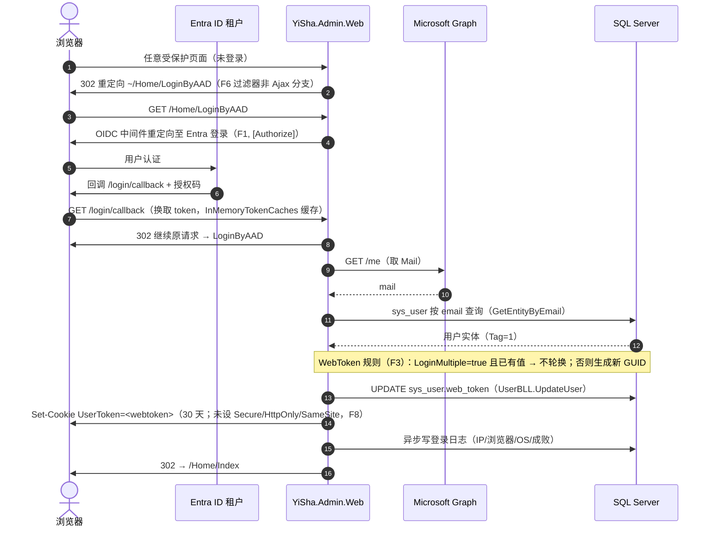
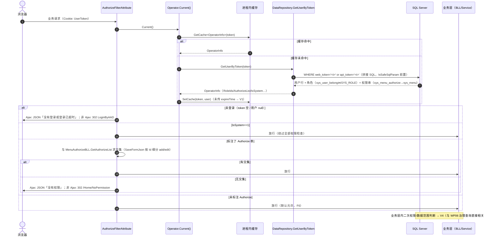
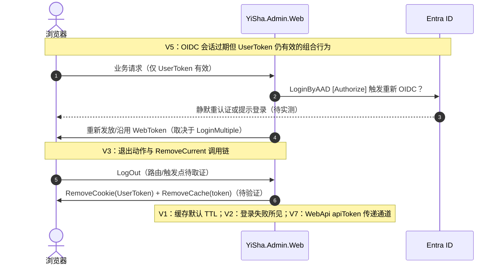

# DPA 当前身份与会话时序（T04.1 附属）

> 与 [dpa-current-identity-fact-chain.md](dpa-current-identity-fact-chain.md) 配套阅读；F 编号对应其中小节。
> 证据基线：`D:\WorkSpace` @ revision `ce9ad5ca`（分支 SSME.DPA.DEV）。
> 本图为源码事实的投影，不含任何凭据值；虚线消息为待验证项（V-\*）。

## 登录与会话建立（F1–F3）

## 已登录请求的解析与授权（F4–F6）

## 待验证链路（V-\*，虚线项）

## 与 Wayfinder 后续工作包的挂钩

- F3/F8 的「令牌无 TTL、不轮换」→ T04.2 同源 Cookie 转发的有效期上界约束。
- F5 的拼接 SQL 与 F6 的默认放行 → T04.6 威胁模型输入。
- 第三节的业务层检查点空缺 → T04.3 IdentityContext 契约必须覆盖业务层可见身份字段（UserId/gid/RoleIds/AuthorizeList）。
- V4 → WP06 治理查询与数据范围的证据入口。
