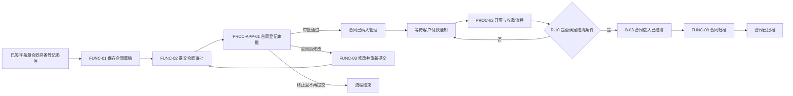
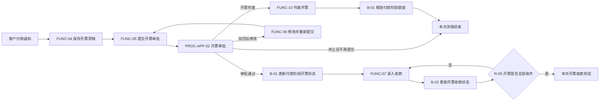
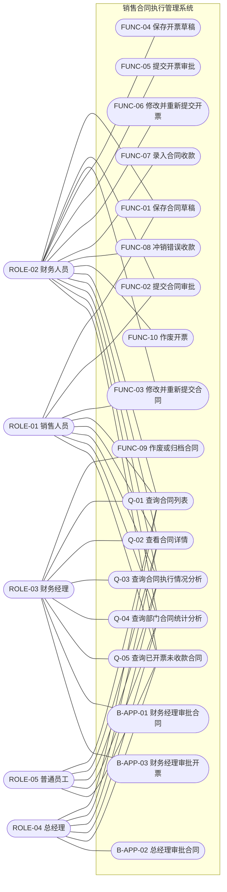
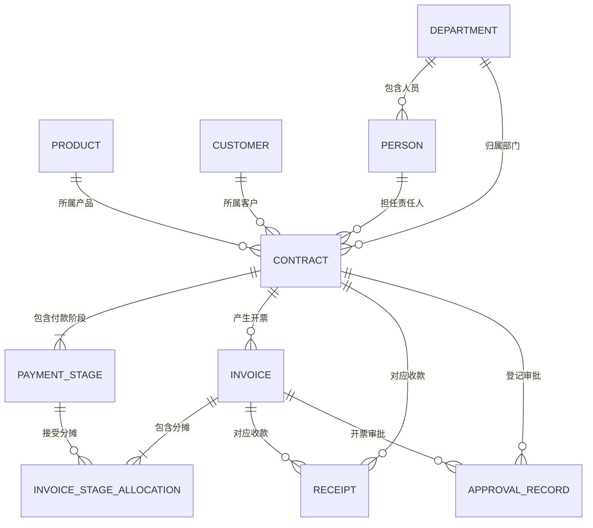
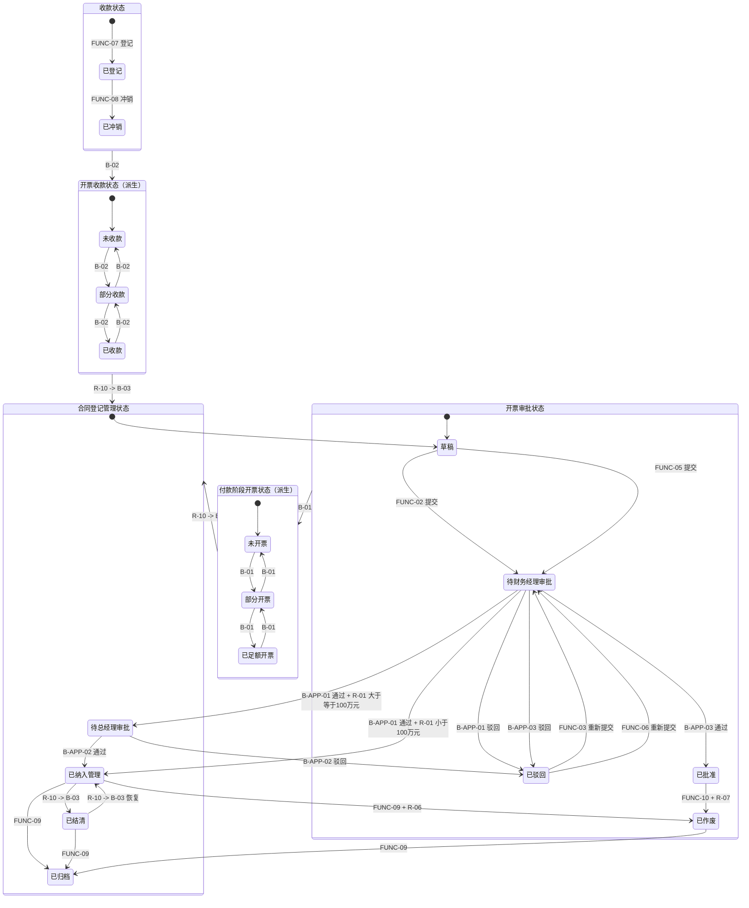
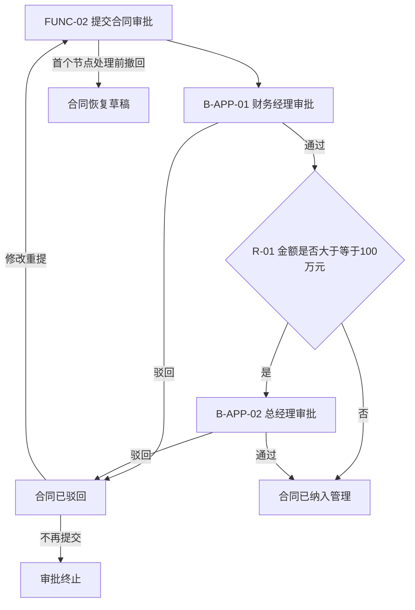
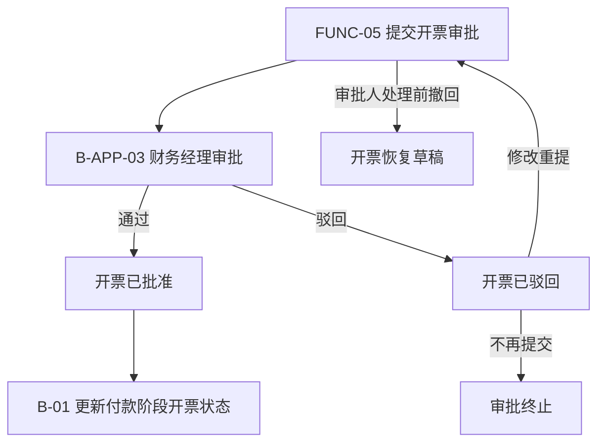

# 销售合同执行管理需求规格说明书

| 项目 | 内容 |
|---|---|
| 文档版本 | V9.0 |
| 需求来源 | 《合同需求.txt》 |
| 编写依据 | 《AI需求探索与确认提示词V9.0.md》、《软件需求编写规范V9.0.md》、《ontology_modeling_framework_v9.md》 |
| UI 原型状态 | 用户已确认需要 AI 协助输出 UI 原型，探索结果见附录 D（补充交付物） |
| 建模取向 | 单体同步系统（七模型：M1/M2/M3/M5/M6/M7/MU；不建模事件、场景、接口） |
| 当前状态 | 完整（可进入本体建模阶段） |

---

# 第一部分 项目概述与范围

## 1.1 项目背景与目标

### 1.1.1 项目背景

`[已确认]` 本项目建设销售合同执行管理能力，仅管理公司对外销售形成且已经完成线下签字盖章的合同。系统不管理合同起草、谈判、签订和盖章过程，而从合同正式生效后的内部登记开始，继续管理合同付款阶段、开票、收款、内部登记审批和查询统计。

### 1.1.2 主要业务痛点

- `[AI自动补全]` 合同、付款阶段、开票和收款信息缺少统一的关联管理。
- `[AI自动补全]` 一个付款阶段多次开票、一次开票覆盖多个付款阶段时，缺少明确的分摊关系。
- `[AI自动补全]` 收款后开票收款状态和合同关闭状态缺少自动联动。
- `[AI自动补全]` 合同登记与开票的内部审核缺少标准化流转和状态追踪。
- `[AI自动补全]` 缺少按合同、部门、产品和时间等条件查询合同执行情况的统一口径。

### 1.1.3 建设目标

1. `[已确认]` 统一登记已生效销售合同及其付款阶段。
2. `[已确认]` 管理付款阶段与开票之间的多对多分摊关系。
3. `[已确认]` 独立记录收款，并自动更新开票收款状态与合同结清状态。
4. `[已确认]` 对合同登记和开票执行内部审批（合同按金额分级）。
5. `[已确认]` 维护产品、客户、部门、人员基础主数据，并提供合同执行查询与固定统计报表。

## 1.2 业务范围

### 1.2.1 范围内

- `[已确认]` 已生效销售合同登记及内部审批。
- `[已确认]` 合同付款阶段管理。
- `[已确认]` 开票登记、付款阶段分摊及内部审批。
- `[已确认]` 收款登记、收款冲销及开票/合同状态自动联动。
- `[已确认]` 合同详情、列表查询及固定统计报表。
- `[已确认]` 产品、客户、部门、人员主数据维护。
- `[已确认]` 岗位功能权限。

### 1.2.2 范围外

- `[已确认]` 合同起草、谈判、签署和盖章。
- `[已确认]` 采购合同管理。
- `[已确认]` 客户实际付款操作和银行资金处理。
- `[已确认]` 用户账号管理、角色配置、人员与角色绑定（由统一身份/权限管理能力负责）。
- `[已确认]` BI 数仓、指标平台、数据仓库与即席分析。
- `[已确认]` 页面配色、字体等视觉设计（UI 原型仅表达布局，见附录 D）。

### 1.2.3 外部边界

- `[已确认]` 产品、客户、部门和人员主数据在本系统内维护，不依赖外部主数据系统。
- `[AI自动补全]` 客户付款通知和银行到账事实由业务人员核实后录入，本阶段不假设存在银行或财务系统接口。
- `[已确认]` 本系统不对外提供接口、也不依赖外部接口（V9.0 已取消接口需求）。

## 1.3 业务域划分

| 业务域 | 说明 | 承载对象 |
|---|---|---|
| 主数据域 | 为合同提供产品、客户、组织和责任人引用 | 产品、客户、部门、人员 |
| 合同域 | 管理合同及其付款阶段和登记审批 | 合同、合同付款阶段、审批记录 |
| 开票域 | 管理开票、付款阶段分摊及开票审批 | 开票、开票付款阶段分摊、审批记录 |
| 收款域 | 独立记录客户收款并更新开票/合同状态 | 收款、开票、合同 |
| 查询报表域 | 提供合同执行查询和统计分析 | REP-01～REP-05 |
| 权限域 | 管理岗位执行功能和审批行为的权限 | ROLE-01～ROLE-06 |

## 1.4 端到端业务流程全景

### 1.4.1 PROC-01 合同全生命周期流程

| 项目 | 内容 |
|---|---|
| 流程编号 | `PROC-01` |
| 流程名称 | 合同全生命周期流程 |
| 流程类型 | `COLLABORATION` |
| 业务目标 | 将已线下生效合同纳入内部管理，持续跟踪开票、收款、结清和归档 |
| 业务对象范围 | 合同、付款阶段、开票、分摊、收款、审批记录 |
| 开始条件 | 销售合同已完成线下签字盖章，具备登记条件 |
| 结束条件 | 合同已归档，或登记审批终止后不再重新发起 |
| 业务阶段 | 合同登记、登记审批、执行开票、客户收款、自动结清、归档 |
| 调用 | `PROC-APP-01`、`PROC-02` |

| 环节 | 业务活动 | 执行功能/行为 | 操作对象 | 执行角色 | 引用 |
|---|---|---|---|---|---|
| 1 | 保存合同草稿 | `FUNC-01` | 合同、付款阶段 | 销售人员/财务人员 | `INV-01`、`INV-02` |
| 2 | 提交合同审批 | `FUNC-02` | 合同 | 销售人员/财务人员 | `R-01`、`R-13` |
| 3 | 完成合同登记审批 | `PROC-APP-01` | 合同、审批记录 | 财务经理/总经理 | `R-01` |
| 4 | 等待客户付款通知 | 无状态变更 | 合同 | 业务人员 | 无 |
| 5 | 执行开票与收款循环 | `PROC-02` | 开票、付款阶段、收款 | 财务人员等 | 见 1.4.2 |
| 6 | 自动判断合同结清 | `R-10`、`B-03` | 合同 | 系统自动 | `B-01`、`B-02` |
| 7 | 作废或归档合同 | `FUNC-09` | 合同 | 财务经理 | `R-06` |



### 1.4.2 PROC-02 合同开票与收款流程

| 项目 | 内容 |
|---|---|
| 流程编号 | `PROC-02` |
| 流程名称 | 合同开票与收款流程 |
| 流程类型 | `COLLABORATION` |
| 业务目标 | 根据客户付款通知完成开票审批、付款阶段占用、收款登记和状态联动 |
| 业务对象范围 | 合同、付款阶段、开票、分摊、收款、审批记录 |
| 开始条件 | 合同已纳入管理且客户已发出付款通知 |
| 结束条件 | 本次有效开票已全部收齐，或开票审批终止/开票作废 |
| 业务阶段 | 开票登记、开票审批、阶段状态更新、收款登记、开票状态更新 |
| 调用 | `PROC-APP-02` |

| 环节 | 业务活动 | 执行功能/行为 | 操作对象 | 执行角色 | 引用 |
|---|---|---|---|---|---|
| 1 | 保存开票草稿 | `FUNC-04` | 开票、分摊 | 财务人员 | `R-02`、`R-03`、`R-08` |
| 2 | 提交开票审批 | `FUNC-05` | 开票 | 财务人员 | `INV-03`、`R-11` |
| 3 | 完成开票审批 | `PROC-APP-02` | 开票、审批记录 | 财务经理 | `R-09` |
| 4 | 更新付款阶段开票状态 | `B-01` | 付款阶段、合同 | 系统自动 | `R-10` |
| 5 | 登记一笔或多笔收款 | `FUNC-07` | 收款 | 财务人员 | `R-04` |
| 6 | 更新开票及合同状态 | `B-02`、`B-03` | 开票、合同 | 系统自动 | `R-05`、`R-10` |
| 7 | 未收齐时继续登记收款 | `FUNC-07` | 收款 | 财务人员 | `R-05` |



### 1.4.3 与建模章节的引用关系

- `PROC-01` 的 M6 定义见 4.3.1，合同登记审批见 4.4.1。
- `PROC-02` 的 M6 定义见 4.3.2，开票审批见 4.4.2。
- 跨对象联动（`syncTriggers`）见 4.1。
- 流程调用的功能、规则、行为分别见 2.2、2.3。

## 1.5 核心清单总览

### 1.5.1 核心对象

产品、客户、部门、人员、合同、合同付款阶段、开票、开票付款阶段分摊、收款、审批记录。

### 1.5.2 核心功能

- `FUNC-01` 保存合同草稿　`FUNC-02` 提交合同审批　`FUNC-03` 修改并重新提交合同
- `FUNC-04` 保存开票草稿　`FUNC-05` 提交开票审批　`FUNC-06` 修改并重新提交开票
- `FUNC-07` 录入合同收款　`FUNC-08` 冲销错误收款
- `FUNC-09` 作废或归档合同　`FUNC-10` 作废开票
- `FUNC-11`～`FUNC-14` 产品/客户/部门/人员主数据维护
- `Q-01`～`Q-05` 查询合同列表、详情、执行分析、部门汇总、已开票未收款分析

### 1.5.3 跨对象联动

- 收款登记/冲销 → 更新开票收款状态 → 判断合同结清 → 关闭/恢复合同
- 开票批准/作废 → 更新付款阶段开票状态 → 判断合同结清

### 1.5.4 查询报表

- `REP-01` 合同综合查询　`REP-02` 合同详情查询　`REP-03` 合同执行情况分析　`REP-04` 部门合同统计分析报表　`REP-05` 已开票未收款合同分析

## 1.6 角色总览

`[已确认]`

- `ROLE-01` 销售人员
- `ROLE-02` 财务人员
- `ROLE-03` 财务经理
- `ROLE-04` 总经理
- `ROLE-05` 普通员工
- `ROLE-06` 系统自动执行主体

---

# 第二部分 业务功能与规则

## 2.1 业务功能清单

| 编号 | 功能名称 | 操作角色 | 类型 |
|---|---|---|---|
| `FUNC-01` | 保存合同草稿 | 销售人员、财务人员 | 新增/草稿 |
| `FUNC-02` | 提交合同审批 | 销售人员、财务人员 | 提交 |
| `FUNC-03` | 修改并重新提交合同 | 销售人员、财务人员 | 修改/提交 |
| `FUNC-04` | 保存开票草稿 | 财务人员 | 新增/草稿 |
| `FUNC-05` | 提交开票审批 | 财务人员 | 提交 |
| `FUNC-06` | 修改并重新提交开票 | 财务人员 | 修改/提交 |
| `FUNC-07` | 录入合同收款 | 财务人员 | 新增（直接生效） |
| `FUNC-08` | 冲销错误收款 | 财务人员 | 状态变更 |
| `FUNC-09` | 作废或归档合同 | 财务经理 | 状态变更 |
| `FUNC-10` | 作废开票 | 财务人员 | 状态变更 |
| `FUNC-11` | 维护产品信息 | 财务经理 | 增删改查 |
| `FUNC-12` | 维护客户信息 | 财务经理 | 增删改查 |
| `FUNC-13` | 维护部门信息 | 财务经理 | 增删改查 |
| `FUNC-14` | 维护人员信息 | 财务经理 | 增删改查 |
| `Q-01` | 查询合同列表 | 全部人工岗位 | 查询 |
| `Q-02` | 查看合同详情 | 全部人工岗位 | 查询 |
| `Q-03` | 查询合同执行情况分析 | 全部人工岗位 | 查询 |
| `Q-04` | 查询部门合同统计分析 | 全部人工岗位 | 查询 |
| `Q-05` | 查询已开票未收款合同 | 全部人工岗位 | 查询 |
| `B-APP-01` | 财务经理审批合同 | 财务经理 | 审批 |
| `B-APP-02` | 总经理审批合同 | 总经理 | 审批 |
| `B-APP-03` | 财务经理审批开票 | 财务经理 | 审批 |
| `B-01` | 更新付款阶段开票状态 | 系统自动 | 自动行为 |
| `B-02` | 更新开票收款状态 | 系统自动 | 自动行为 |
| `B-03` | 更新合同结清状态 | 系统自动 | 自动行为 |

### 2.1.2 角色-功能业务用例图



> 注：`FUNC-11`～`FUNC-14`（主数据维护）由财务经理执行，为简洁未在图中单独列出；`B-01`～`B-03` 为系统自动行为，不连接人工角色。

### 2.1.3 用例图覆盖说明

| 角色 | 关联功能/行为 | 是否已在用例图呈现 | 与 6.2 权限矩阵是否一致 |
|---|---|---|---|
| `ROLE-01` 销售人员 | `FUNC-01`～`FUNC-03`、`Q-01`～`Q-05` | 是 | 是 |
| `ROLE-02` 财务人员 | `FUNC-01`～`FUNC-08`、`FUNC-10`、`Q-01`～`Q-05` | 是 | 是 |
| `ROLE-03` 财务经理 | `FUNC-09`、`FUNC-11`～`FUNC-14`、`B-APP-01`、`B-APP-03`、`Q-01`～`Q-05` | 是 | 是 |
| `ROLE-04` 总经理 | `B-APP-02`、`Q-01`～`Q-05` | 是 | 是 |
| `ROLE-05` 普通员工 | `Q-01`～`Q-05`（仅本部门） | 是 | 是 |

## 2.2 功能详述

### 2.2.1 FUNC-01 保存合同草稿

| 项目 | 内容 |
|---|---|
| 操作角色 | 销售人员、财务人员 |
| 主操作对象 | 合同、合同付款阶段 |
| 前置条件 | 合同已完成线下签字盖章；引用的产品、客户、部门、人员有效 |
| 操作步骤 | 1. 录入合同基本信息；2. 录入至少一条付款阶段；3. 校验属性规则和对象不变量；4. 保存为草稿 |
| 涉及规则 | `INV-01`、`INV-02`、`R-13` |
| 后置状态变更 | 合同及付款阶段已创建，合同状态为"草稿" |
| 同步联动 | 无 |

### 2.2.2 FUNC-02 提交合同审批

| 项目 | 内容 |
|---|---|
| 操作角色 | 销售人员、财务人员 |
| 主操作对象 | 合同 |
| 前置条件 | 合同状态为"草稿"，且所有校验通过 |
| 操作步骤 | 1. 校验属性规则和对象不变量；2. 提交进入审批 |
| 涉及规则 | `INV-01`、`INV-02`、`R-01`、`R-13` |
| 后置状态变更 | 合同状态由"草稿"变为"待财务经理审批" |
| 同步联动 | 启动 `PROC-APP-01` 合同登记审批 |

### 2.2.3 FUNC-03 修改并重新提交合同

| 项目 | 内容 |
|---|---|
| 操作角色 | 销售人员、财务人员 |
| 主操作对象 | 合同、合同付款阶段 |
| 前置条件 | 合同状态为"已驳回" |
| 操作步骤 | 1. 修改被驳回内容；2. 重新校验；3. 重新提交审批 |
| 涉及规则 | `INV-01`、`INV-02`、`R-01`、`R-13` |
| 后置状态变更 | 合同状态由"已驳回"变为"待财务经理审批" |
| 同步联动 | 重新启动 `PROC-APP-01` |

### 2.2.4 FUNC-04 保存开票草稿

| 项目 | 内容 |
|---|---|
| 操作角色 | 财务人员 |
| 主操作对象 | 开票、开票付款阶段分摊 |
| 前置条件 | 对应合同已生效（已纳入管理）且未作废/归档 |
| 操作步骤 | 1. 录入开票信息；2. 选择一个或多个付款阶段；3. 录入分摊金额；4. 默认是否收款为否；5. 保存为草稿 |
| 涉及规则 | `INV-03`、`R-02`、`R-03`、`R-08`、`R-11` |
| 后置状态变更 | 开票及分摊已创建，开票状态为"草稿" |
| 同步联动 | 无 |

### 2.2.5 FUNC-05 提交开票审批

| 项目 | 内容 |
|---|---|
| 操作角色 | 财务人员 |
| 主操作对象 | 开票 |
| 前置条件 | 开票状态为"草稿"，且校验通过 |
| 操作步骤 | 1. 校验分摊平衡、额度、税率；2. 提交审批 |
| 涉及规则 | `INV-03`、`R-02`、`R-03`、`R-08`、`R-11` |
| 后置状态变更 | 开票状态由"草稿"变为"待财务经理审批" |
| 同步联动 | 启动 `PROC-APP-02` 开票审批 |

### 2.2.6 FUNC-06 修改并重新提交开票

| 项目 | 内容 |
|---|---|
| 操作角色 | 财务人员 |
| 主操作对象 | 开票、开票付款阶段分摊 |
| 前置条件 | 开票状态为"已驳回" |
| 操作步骤 | 1. 修改开票和分摊；2. 重新校验；3. 重新提交审批 |
| 涉及规则 | `INV-03`、`R-02`、`R-03`、`R-08`、`R-11` |
| 后置状态变更 | 开票状态由"已驳回"变为"待财务经理审批" |
| 同步联动 | 重新启动 `PROC-APP-02` |

### 2.2.7 FUNC-07 录入合同收款

| 项目 | 内容 |
|---|---|
| 操作角色 | 财务人员 |
| 主操作对象 | 收款 |
| 前置条件 | 对应开票已批准且未作废；对应合同未作废 |
| 操作步骤 | 1. 选择合同和开票；2. 录入收款金额、时间、方式；3. 校验合同与开票一致、累计不超额；4. 直接生效登记 |
| 涉及规则 | `R-04`、`R-05`、`R-12` |
| 后置状态变更 | 新增一条"已登记"收款记录 |
| 同步联动 | `B-02 -> R-10 -> B-03`（更新开票收款状态，再判断合同结清） |

### 2.2.8 FUNC-08 冲销错误收款

| 项目 | 内容 |
|---|---|
| 操作角色 | 财务人员 |
| 主操作对象 | 收款 |
| 前置条件 | 收款状态为"已登记" |
| 操作步骤 | 1. 选择错误收款；2. 填写冲销原因；3. 确认冲销 |
| 涉及规则 | `R-05` |
| 后置状态变更 | 收款状态变为"已冲销"，保留原记录 |
| 同步联动 | `B-02 -> R-10 -> B-03`（重算开票收款状态及合同结清状态） |

### 2.2.9 FUNC-09 作废或归档合同

| 项目 | 内容 |
|---|---|
| 操作角色 | 财务经理 |
| 主操作对象 | 合同 |
| 前置条件 | 作废时满足下游凭证限制（`R-06`）；归档时合同已结束执行 |
| 操作步骤 | 1. 选择作废或归档；2. 填写原因；3. 校验资格；4. 完成状态变更 |
| 涉及规则 | `R-06` |
| 后置状态变更 | 合同变为"已作废"或"已归档" |
| 同步联动 | 无必然联动；作废后禁止新增开票 |

### 2.2.10 FUNC-10 作废开票

| 项目 | 内容 |
|---|---|
| 操作角色 | 财务人员 |
| 主操作对象 | 开票 |
| 前置条件 | 开票已批准且无有效收款 |
| 操作步骤 | 1. 选择开票；2. 填写作废原因；3. 校验无有效收款；4. 完成作废 |
| 涉及规则 | `R-07` |
| 后置状态变更 | 开票状态变为"已作废" |
| 同步联动 | `B-01 -> R-10 -> B-03`（释放付款阶段额度，再判断合同结清） |

### 2.2.11 FUNC-11～FUNC-14 主数据维护

| 项目 | 内容 |
|---|---|
| 操作角色 | 财务经理 |
| 主操作对象 | 产品、客户、部门、人员 |
| 前置条件 | 具备对应维护权限 |
| 操作步骤 | 列表查询 → 新增/编辑 → 校验唯一性 → 保存；停用或删除 |
| 涉及规则 | 唯一性、必填校验；被引用后不可删除，只能停用 |
| 后置状态变更 | 主数据新增/修改/停用 |
| 同步联动 | 无 |

### 2.2.12 查询行为 Q-01～Q-05

| 行为 | 操作对象 | 操作步骤 | 后置状态 | 同步联动 |
|---|---|---|---|---|
| `Q-01` 查询合同列表 | `REP-01` | 按编号、名称、产品、部门、时间等模糊查询 | 无 | 无 |
| `Q-02` 查看合同详情 | `REP-02` | 查看合同完整执行信息 | 无 | 无 |
| `Q-03` 查询合同执行情况分析 | `REP-03` | 按合同汇总收款进度 | 无 | 无 |
| `Q-04` 查询部门合同统计分析 | `REP-04` | 按部门汇总合同执行情况 | 无 | 无 |
| `Q-05` 查询已开票未收款合同 | `REP-05` | 查询已开票未收齐的欠款清单 | 无 | 无 |

### 2.2.13 审批及自动行为

| 行为 | 前置条件 | 处理 | 后置状态 | 同步联动 |
|---|---|---|---|---|
| `B-APP-01` 财务经理审批合同 | 合同待财务经理审批；`R-09` 禁止自批 | 通过或驳回 | 通过后按 `R-01` 进入已纳入管理或待总经理审批；驳回进入已驳回 | 通过且金额<100万 → 合同已纳入管理；金额≥100万 → 转 `B-APP-02` |
| `B-APP-02` 总经理审批合同 | 合同待总经理审批；`R-09` 禁止自批 | 通过或驳回 | 通过后已纳入管理；驳回进入已驳回 | 结束审批 |
| `B-APP-03` 财务经理审批开票 | 开票待财务经理审批；`R-09` 禁止自批 | 通过或驳回 | 通过后已批准；驳回进入已驳回 | 通过 → `B-01 -> R-10 -> B-03` |
| `B-01` 更新付款阶段开票状态 | 开票批准或作废后 | 汇总已批准未作废开票的分摊金额 | 未开票/部分开票/已足额开票 | `R-10 -> B-03` |
| `B-02` 更新开票收款状态 | `R-05` 判定后 | 汇总有效收款金额 | 更新已收款金额、是否收款、完成时间 | `R-10 -> B-03` |
| `B-03` 更新合同结清状态 | `R-10` 判定后 | 按规则结果更新 | 已结清 或 恢复已纳入管理 | 无 |

## 2.3 业务规则

### 2.3.1 属性级规则 REF

| 编号 | 所属对象/属性 | 规则名称 | 表达式（value 为当前值） | 违反提示 | 执行时机 |
|---|---|---|---|---|---|
| `REF-01` | 合同.合同总金额 | 金额为正 | `value > 0` | 合同总金额必须大于 0 | 保存及提交 |
| `REF-02` | 合同.对外采购金额 | 采购金额非负 | `value >= 0` | 对外采购金额不能小于 0 | 保存及提交 |
| `REF-03` | 合同.合同税率 | 税率范围 | `value >= 0 && value <= 1` | 税率须为 0~1 小数 | 保存及提交 |
| `REF-04` | 付款阶段.付款比例 | 比例范围 | `value > 0 && value <= 100` | 付款比例须大于 0 且不超过 100 | 保存及提交 |
| `REF-05` | 开票.开票金额 | 金额为正 | `value > 0` | 开票金额必须大于 0 | 保存及提交 |
| `REF-06` | 开票.开票税率 | 税率范围 | `value >= 0 && value <= 1` | 税率须为 0~1 小数 | 保存及提交 |
| `REF-07` | 分摊.分摊金额 | 金额为正 | `value > 0` | 分摊金额必须大于 0 | 保存及提交 |
| `REF-08` | 收款.收款金额 | 金额为正 | `value > 0` | 收款金额必须大于 0 | 保存及提交 |
| `REF-09` | 合同.合同名称 | 名称长度 | `LENGTH(value) <= 100` | 合同名称不超过 100 字 | 保存及提交 |

> 非空、唯一等约束使用属性内置字段（required/unique）表达，不重复列为 REF。

### 2.3.2 对象级不变量 INV

| 编号 | 所属对象 | 规则名称 | 业务条件 |
|---|---|---|---|
| `INV-01` | 合同 | 采购金额不超过合同金额 | 对外采购金额 ≤ 合同总金额 |
| `INV-02` | 合同聚合 | 付款比例合计完整 | 所有付款阶段比例合计 = 100% |
| `INV-03` | 开票聚合 | 分摊金额平衡 | 同一开票的分摊金额合计 = 开票金额 |
| `INV-04` | 开票 | 已收款金额范围 | 0 ≤ 已收款金额 ≤ 开票金额 |
| `INV-05` | 开票 | 收款完成信息一致 | 是否收款=是时，已收款金额=开票金额且完成时间非空 |

### 2.3.3 跨对象规则 R

| 编号 | 名称 | 规则类型 | 业务判断 | 输入来源 | 输出结果 | 被调用 |
|---|---|---|---|---|---|---|
| `R-01` | 合同审批层级判定 | 流程决策 | 合同总金额是否 ≥ 100 万元 | 合同 | 需要/不需要总经理审批 | `FUNC-02`、`FUNC-03`、`B-APP-01` |
| `R-02` | 合同可开票资格 | 跨对象校验 | 合同已纳入管理且未作废、未归档 | 合同、开票 | 允许/拒绝 | `FUNC-04`～`FUNC-06` |
| `R-03` | 付款阶段剩余可开票额度 | 跨对象校验 | 累计有效分摊 ≤ 阶段应付金额 | 付款阶段、分摊 | 允许/拒绝 | `FUNC-04`～`FUNC-06` |
| `R-04` | 开票剩余可收款额度 | 跨对象校验 | 累计有效收款 ≤ 开票金额 | 开票、收款 | 允许/拒绝 | `FUNC-07` |
| `R-05` | 开票收款状态判定 | 跨对象判定 | 有效收款累计相对开票金额处于未收款/部分/全部 | 开票、收款 | 收款状态 | `B-02`（同步联动） |
| `R-06` | 合同作废资格 | 跨对象校验 | 不存在已批准开票或有效收款 | 合同、开票、收款 | 允许/拒绝 | `FUNC-09` |
| `R-07` | 开票作废资格 | 跨对象校验 | 不存在有效收款 | 开票、收款 | 允许/拒绝 | `FUNC-10` |
| `R-08` | 开票税率一致性 | 跨对象校验 | 开票税率 = 合同税率 | 合同、开票 | 允许/拒绝 | `FUNC-04`～`FUNC-06` |
| `R-09` | 提交审批职责分离 | 权限决策 | 审批人 ≠ 提交人 | 合同/开票、提交人、审批人 | 允许/拒绝 | `B-APP-01`～`B-APP-03` |
| `R-10` | 合同结清资格判定 | 跨对象判定 | 全部阶段足额开票且全部有效开票收齐 | 合同、付款阶段、开票、收款 | 可结清/不可结清 | `B-01`、`B-02`（同步联动） |
| `R-11` | 分摊所属合同一致性 | 跨对象校验 | 分摊、开票、付款阶段属同一合同 | 开票、付款阶段、分摊 | 允许/拒绝 | `FUNC-04`～`FUNC-06` |
| `R-12` | 收款所属合同一致性 | 跨对象校验 | 收款合同 = 开票合同 | 合同、开票、收款 | 允许/拒绝 | `FUNC-07` |
| `R-13` | 责任人部门一致性 | 跨对象校验 | 责任人部门 = 合同部门 | 合同、人员、部门 | 允许/拒绝 | `FUNC-01`～`FUNC-03` |

### 2.3.4 规则归属唯一性说明

- REF 只依赖单个属性值，属于 M1 属性内置约束（refRules）。
- INV 只依赖同一对象或其聚合内部数据，属于 M1 对象不变量（invariants）。
- R 涉及跨对象判断，属于 M3 独立规则，由行为调用或经同步联动（syncTriggers）调用。
- 同一业务判断未在 REF、INV、R 之间重复定义。

---

# 第三部分 业务对象

> 以下对象属性和通用约束基于原始需求、行业惯例及阶段一确认结果形成；所有企业专属口径均已确认。

## 3.1 产品（主数据，本系统维护）

| 属性 | 类型 | 必填 | 唯一 | 说明/约束 |
|---|---|---|---|---|
| 产品编号 | 字符串 | 是 | 是 | 全局唯一 |
| 产品类型 | 数据字典 | 是 | 否 | 引用产品类型字典 |
| 产品名称 | 字符串 | 是 | 否 | 非空 |

## 3.2 客户（主数据，本系统维护）

| 属性 | 类型 | 必填 | 唯一 | 说明/约束 |
|---|---|---|---|---|
| 客户编号 | 字符串 | 是 | 是 | 全局唯一 |
| 客户类型 | 数据字典 | 是 | 否 | 引用客户类型字典 |
| 客户名称 | 字符串 | 是 | 否 | 非空 |

## 3.3 部门（主数据，本系统维护）

| 属性 | 类型 | 必填 | 唯一 | 说明/约束 |
|---|---|---|---|---|
| 部门编号 | 字符串 | 是 | 是 | 全局唯一 |
| 部门名称 | 字符串 | 是 | 否 | 非空 |

## 3.4 人员（主数据，本系统维护）

| 属性 | 类型 | 必填 | 唯一 | 说明/约束 |
|---|---|---|---|---|
| 人员编号 | 字符串 | 是 | 是 | 全局唯一 |
| 人员名称 | 字符串 | 是 | 否 | 非空 |
| 所属部门 | 部门引用 | 是 | 否 | 引用一个有效部门 |

## 3.5 合同（核心对象，含付款阶段复合对象）

`[已确认]` 已完成线下签字盖章、进入本系统执行管理的销售合同。合同基本信息与付款阶段是复合对象（合同为整体，付款阶段为明细）。

| 属性 | 类型 | 必填 | 唯一 | 说明/约束 |
|---|---|---|---|---|
| 合同编号 | 字符串 | 是 | 是 | 全局唯一 |
| 合同名称 | 字符串 | 是 | 否 | `REF-09` 不超过 100 字 |
| 所属产品 | 产品引用 | 是 | 否 | 引用有效产品 |
| 所属客户 | 客户引用 | 是 | 否 | 引用有效客户 |
| 所属部门 | 部门引用 | 是 | 否 | 引用有效部门 |
| 合同类型 | 数据字典 | 是 | 否 | 产品合同 / 服务合同 / 集成合同（灵活配置） |
| 合同签订时间 | 日期 | 是 | 否 | 线下完成签订的日期 |
| 责任人 | 人员引用 | 是 | 否 | `R-13` 责任人所属部门须与合同所属部门一致 |
| 合同总金额 | 含税金额 | 是 | 否 | `REF-01` 须大于 0 |
| 合同对外采购金额 | 含税金额 | 是 | 否 | `REF-02` 不小于 0；`INV-01` 不超过合同总金额 |
| 合同税率 | 小数 | 是 | 否 | `REF-03` 取值 0~1 |
| 登记管理状态 | 枚举 | 是 | 否 | 见 3.11.1 状态清单 |
| 登记时间 | 日期时间 | 是 | 否 | 首次录入时间 |
| 登记人 | 人员引用 | 是 | 否 | 执行录入的人员 |

对象级不变量：

- `INV-01` 合同对外采购金额不得大于合同总金额。
- `INV-02` 合同所有付款阶段的付款比例合计等于 100%。
- `R-13` 合同责任人与合同部门一致，见 2.3.3。

## 3.6 合同付款阶段（合同从属明细）

`[已确认]` 合同的从属明细，与合同基本信息共同构成完整合同登记内容。

| 属性 | 类型 | 必填 | 唯一 | 说明/约束 |
|---|---|---|---|---|
| 所属合同 | 合同引用 | 是 | 联合唯一 | 与付款阶段编号联合唯一 |
| 付款阶段编号 | 字符串 | 是 | 联合唯一 | 同一合同内唯一 |
| 付款阶段名称 | 字符串 | 是 | 否 | 非空 |
| 付款比例 | 百分比 | 是 | 否 | `REF-04` 大于 0 且不超过 100 |
| 阶段应付金额 | 金额（派生） | 是 | 否 | 合同总金额 × 付款比例 |
| 阶段开票状态 | 枚举（派生） | 是 | 否 | 未开票 / 部分开票 / 已足额开票 |

## 3.7 开票（独立业务对象）

`[已确认]` 针对一个合同登记的开票记录，可通过分摊覆盖一个或多个付款阶段。

| 属性 | 类型 | 必填 | 唯一 | 说明/约束 |
|---|---|---|---|---|
| 开票编号 | 字符串 | 是 | 是 | 全局唯一 |
| 对应合同 | 合同引用 | 是 | 否 | 只能引用已纳入管理且未作废的合同 |
| 开票金额 | 含税金额 | 是 | 否 | `REF-05` 须大于 0 |
| 开票税率 | 小数 | 是 | 否 | `REF-06` 取值 0~1；`R-08` 与合同税率一致 |
| 开票时间 | 日期 | 是 | 否 | 实际开票日期 |
| 是否收款 | 布尔值 | 是 | 否 | 默认"未收款"（false） |
| 收款完成时间 | 日期时间 | 否 | 否 | 全部收齐后由系统更新 |
| 已收款金额 | 金额 | 是 | 否 | 默认 0，由有效收款累计 |
| 开票审批状态 | 枚举 | 是 | 否 | 见 3.11.2 状态清单 |

对象级不变量：

- `INV-03` 同一开票下各付款阶段分摊金额合计等于开票金额。
- `INV-04` 已收款金额不得小于 0，且不得大于开票金额。
- `INV-05` 是否收款为"是"时，已收款金额等于开票金额且收款完成时间不为空。

## 3.8 开票付款阶段分摊（关联对象）

`[已确认]` 显式承载开票与付款阶段之间的多对多关系（一个阶段可多次开票、多个阶段可一次开票）。

| 属性 | 类型 | 必填 | 唯一 | 说明/约束 |
|---|---|---|---|---|
| 对应开票 | 开票引用 | 是 | 联合唯一 | 与付款阶段联合唯一 |
| 对应合同 | 合同引用 | 是 | 否 | `R-11` 须与开票、付款阶段所属合同一致 |
| 对应付款阶段 | 付款阶段引用 | 是 | 联合唯一 | 同一开票不得重复关联同一阶段 |
| 分摊金额 | 含税金额 | 是 | 否 | `REF-07` 须大于 0 |

跨对象规则引用：

- `R-11` 分摊记录中的合同、开票所属合同和付款阶段所属合同必须一致。
- `R-03` 同一付款阶段累计有效分摊金额不得超过阶段应付金额。

## 3.9 收款（独立业务对象）

`[已确认]` 独立记录客户针对具体合同和开票的每笔收款，允许一张开票分多次收款。

| 属性 | 类型 | 必填 | 唯一 | 说明/约束 |
|---|---|---|---|---|
| 收款编号 | 字符串 | 是 | 是 | 全局唯一 |
| 对应合同 | 合同引用 | 是 | 否 | `R-12` 须与对应开票所属合同一致 |
| 对应开票 | 开票引用 | 是 | 否 | 只能引用已批准且未作废的开票 |
| 收款金额 | 金额 | 是 | 否 | `REF-08` 须大于 0 |
| 收款时间 | 日期时间 | 是 | 否 | 客户款项确认到账时间 |
| 收款方式 | 数据字典 | 否 | 否 | 银行转账 / 票据 / 其他 |
| 收款状态 | 枚举 | 是 | 否 | 已登记 / 已冲销 |
| 备注 | 字符串 | 否 | 否 | 补充说明 |

跨对象规则引用：

- `R-12` 收款对应合同必须与开票所属合同一致。
- `R-04` 同一开票的有效收款累计金额不得超过开票金额。

## 3.10 审批记录（历史对象）

`[AI自动补全]` 记录合同登记审批和开票审批的人工处理历史。

| 属性 | 类型 | 必填 | 唯一 | 说明/约束 |
|---|---|---|---|---|
| 审批记录编号 | 字符串 | 是 | 是 | 全局唯一 |
| 业务类型 | 枚举 | 是 | 否 | 合同登记 / 开票 |
| 业务单据编号 | 字符串 | 是 | 否 | 对应合同或开票编号 |
| 审批节点 | 数据字典 | 是 | 否 | 财务经理审批 / 总经理审批 |
| 审批角色 | 角色引用 | 是 | 否 | 引用审批角色 |
| 审批人员 | 人员引用 | 是 | 否 | 实际完成人员 |
| 审批结果 | 枚举 | 是 | 否 | 通过 / 驳回 |
| 审批意见 | 字符串 | 否 | 否 | 审批说明 |
| 审批时间 | 日期时间 | 是 | 否 | 实际完成时间 |

## 3.11 状态迁移

### 3.11.1 合同登记管理状态

| 当前状态 | 触发行为 | 下一状态 | 说明 |
|---|---|---|---|
| 草稿 | `FUNC-02` 提交 | 待财务经理审批 | 校验通过 |
| 已驳回 | `FUNC-03` 重新提交 | 待财务经理审批 | 修改后再次发起审批 |
| 待财务经理审批 | 财务经理通过且金额 < 100 万元 | 已纳入管理 | 审批结束 |
| 待财务经理审批 | 财务经理通过且金额 ≥ 100 万元 | 待总经理审批 | 进入第二级审批 |
| 待财务经理审批 | 财务经理驳回 | 已驳回 | 待修改或终止 |
| 待总经理审批 | 总经理通过 | 已纳入管理 | 审批结束 |
| 待总经理审批 | 总经理驳回 | 已驳回 | 待修改或终止 |
| 已纳入管理 | `FUNC-09` 作废 | 已作废 | 保留历史，不再允许新增开票 |
| 已纳入管理 | `R-10 -> B-03` | 已结清 | 全部阶段足额开票且全部有效开票收齐 |
| 已结清 | `R-10 -> B-03` | 已纳入管理 | `[已确认]` 因冲销/作废不再满足结清条件时自动恢复；已归档不自动恢复 |
| 已纳入管理/已结清/已作废 | `FUNC-09` 归档 | 已归档 | 生命周期结束 |

### 3.11.2 开票审批状态

| 当前状态 | 触发行为 | 下一状态 | 说明 |
|---|---|---|---|
| 草稿 | `FUNC-05` 提交 | 待财务经理审批 | 开票和分摊信息校验通过 |
| 已驳回 | `FUNC-06` 重新提交 | 待财务经理审批 | 修改后重新提交 |
| 待财务经理审批 | 财务经理通过 | 已批准 | 开票记录正式进入收款管理 |
| 待财务经理审批 | 财务经理驳回 | 已驳回 | 待修改或终止 |
| 已批准 | `FUNC-10` 作废 | 已作废 | 保留历史并停止新增收款 |

### 3.11.3 收款状态

| 当前状态 | 触发行为 | 下一状态 | 说明 |
|---|---|---|---|
| 新建 | `FUNC-07` 登记 | 已登记 | 收款纳入有效累计 |
| 已登记 | `FUNC-08` 冲销 | 已冲销 | 从有效收款累计中扣除并保留历史 |

## 3.12 对象关系总览 ER 图



## 3.13 关系说明表

| 源对象 | 关系 | 目标对象 | 基数 | 承载方式 | 删除/作废策略 |
|---|---|---|---|---|---|
| 产品 | 被合同引用 | 合同 | 1:N | 合同所属产品 | `[已确认]` 被引用后不可删除，只能停用 |
| 客户 | 签订合同 | 合同 | 1:N | 合同所属客户 | `[已确认]` 被引用后不可删除，只能停用 |
| 部门 | 包含人员 | 人员 | 1:N | 人员所属部门 | `[已确认]` 被引用后不可删除，只能停用 |
| 部门 | 归属合同 | 合同 | 1:N | 合同所属部门 | `[已确认]` 被引用后不可删除，只能停用 |
| 人员 | 负责合同 | 合同 | 1:N | 合同责任人 | `[已确认]` 被引用后不可删除，只能停用 |
| 合同 | 包含付款阶段 | 合同付款阶段 | 1:N，至少一条 | 合同从属明细 | `[已确认]` 草稿合同删除时级联删除；提交后保留历史 |
| 合同 | 产生开票 | 开票 | 1:N，可为零 | 开票对应合同 | `[已确认]` 有开票或收款时合同不得删除，只能作废/归档 |
| 开票 | 分摊至付款阶段 | 合同付款阶段 | M:N | 开票付款阶段分摊 | `[已确认]` 随草稿开票删除；批准后保留历史 |
| 合同 | 对应收款 | 收款 | 1:N，可为零 | 收款对应合同 | `[已确认]` 收款不可物理删除，只能冲销 |
| 开票 | 对应收款 | 收款 | 1:N，可为零 | 收款对应开票 | `[已确认]` 有效收款存在时开票不得作废 |
| 合同/开票 | 形成审批历史 | 审批记录 | 1:N，可为零 | 业务类型及单据编号 | `[已确认]` 永久保留审批历史 |

---

# 第四部分 流程

## 4.1 跨对象联动

### 4.1.1 跨对象联动矩阵

| 源功能/行为 | 源对象变化 | 目标对象变化 | 是否跨独立对象 | 联动判定及理由 | 对应规则/行为 |
|---|---|---|---|---|---|
| `FUNC-02` 提交合同 | 合同进入待审批 | 启动合同审批流 | 是 | 提交事实驱动独立流程 | `PROC-APP-01` |
| `FUNC-05` 提交开票 | 开票进入待审批 | 启动开票审批流 | 是 | 提交事实驱动独立流程 | `PROC-APP-02` |
| `B-APP-03` 开票审批通过 | 开票已批准 | 重算付款阶段开票状态 | 是 | 批准事实无条件驱动阶段派生状态更新 | `B-01` |
| `FUNC-10` 作废开票 | 开票已作废 | 释放付款阶段有效额度 | 是 | 作废事实无条件释放有效分摊占用 | `B-01` |
| `FUNC-07` 录入收款 | 新增已登记收款 | 重算开票收款金额和状态 | 是 | 收款事实无条件驱动开票派生状态更新 | `B-02` |
| `FUNC-08` 冲销收款 | 收款已冲销 | 重算开票收款金额和状态 | 是 | 冲销事实无条件驱动开票派生状态更新 | `B-02` |
| `B-01` 更新付款阶段开票状态 | 付款阶段状态变化 | 核对合同结清资格 | 是 | 状态更新事实继续驱动合同判断 | `R-10 -> B-03` |
| `B-02` 更新开票收款状态 | 开票收款状态变化 | 核对合同结清资格 | 是 | 状态更新事实继续驱动合同判断 | `R-10 -> B-03` |
| `FUNC-09` 作废/归档合同 | 合同状态改变 | 无必然下游变化 | 否 | 仅改变当前合同状态 | 无 |
| `B-03` 更新合同结清状态 | 合同进入已结清或恢复 | 无必然下游变化 | 否 | 到此结束 | 无 |
| `Q-01`～`Q-05` | 无状态变化 | 无 | 否 | 查询行为不产生联动 | 无 |

### 4.1.2 同步联动清单（syncTriggers）

| 源行为 | syncTriggers（同步联动） |
|---|---|
| `FUNC-07` 录入收款 | `{behaviorRef: B-02}`（无条件更新开票收款状态） |
| `FUNC-08` 冲销收款 | `{behaviorRef: B-02}` |
| `B-APP-03` 开票审批通过 | `{behaviorRef: B-01}`（无条件更新付款阶段开票状态） |
| `FUNC-10` 作废开票 | `{behaviorRef: B-01}` |
| `B-01` 更新付款阶段开票状态 | `{ruleRef: R-10, behaviorRef: B-03}`（满足结清条件则关闭合同） |
| `B-02` 更新开票收款状态 | `{ruleRef: R-10, behaviorRef: B-03}` |

### 4.1.3 完整联动链

1. `FUNC-02 -> PROC-APP-01`（提交合同，启动审批流）
2. `FUNC-05 -> PROC-APP-02`（提交开票，启动审批流）
3. `B-APP-03 -> B-01 -> R-10 -> B-03`（开票批准 → 更新阶段状态 → 判断结清 → 关闭合同）
4. `FUNC-10 -> B-01 -> R-10 -> B-03`（开票作废 → 释放额度 → 判断结清）
5. `FUNC-07 -> B-02 -> R-10 -> B-03`（收款登记 → 更新开票状态 → 判断结清 → 关闭合同）
6. `FUNC-08 -> B-02 -> R-10 -> B-03`（收款冲销 → 更新开票状态 → 重新判断结清）

### 4.1.4 联动失败处理

- `[已确认]` 同步联动（如收款后关闭合同）中途失败时，源业务事实仍然成立；下游状态联动进入"待处理"并自动重试，不因联动失败回滚源事实。
- `[已确认]` 合同结清后因冲销/作废不再满足结清条件时，自动恢复为"已纳入管理"；已归档合同不自动恢复。

## 4.2 核心对象状态迁移图



## 4.3 端到端协同流（M6）建模定义

### 4.3.1 PROC-01 合同全生命周期流程

- 流程类型：`COLLABORATION`。
- 开始：已签字盖章的销售合同具备登记条件。
- 结束：合同归档，或登记审批实例终止且业务方决定不再重新提交。
- 活动：`FUNC-01 -> FUNC-02 -> PROC-APP-01 -> PROC-02（可循环） -> R-10 -> B-03 -> FUNC-09`。
- 主要分支：合同金额分级审批、审批驳回后重提、客户未通知时等待、合同未结清时继续开票收款、合同作废或归档。
- 详细步骤表和流程图引用 1.4.1。

### 4.3.2 PROC-02 合同开票与收款流程

- 流程类型：`COLLABORATION`。
- 开始：合同已纳入管理且收到客户付款通知。
- 结束：本次开票已全部收齐，或审批实例终止且不再提交，或开票作废。
- 活动：`FUNC-04 -> FUNC-05 -> PROC-APP-02 -> B-01 -> FUNC-07（可重复） -> B-02`。
- 主要分支：审批驳回后修改重提、分次收款循环、错误收款冲销、开票作废后释放付款阶段额度。
- 详细步骤表和流程图引用 1.4.2。

## 4.4 人工审批流（M6）

### 4.4.1 PROC-APP-01 合同登记审批

| 项目 | 内容 |
|---|---|
| 审批对象 | 合同登记记录 |
| 提交人 | 销售人员或财务人员 |
| 提交条件 | 合同及付款阶段校验通过，付款比例合计 100% |
| 第一节点 | `B-APP-01` 财务经理审批 |
| 分级条件 | `R-01`：合同总金额是否 ≥ 100 万元 |
| 第二节点 | 金额 ≥ 100 万元时执行 `B-APP-02` 总经理审批 |
| 节点关系 | `[已确认]` 严格串行；无并行、会签、或签和条件加签 |
| 职责分离 | `R-09`：提交人不得审批本人提交的合同 |
| 通过结果 | < 100 万：财务经理通过后合同已纳入管理；≥ 100 万：总经理通过后已纳入管理 |
| 驳回结果 | `[已确认]` 当前审批实例结束，合同进入已驳回，可修改后重新提交；不设独立退回动作 |
| 撤回结果 | `[已确认]` 首个审批人处理前允许提交人撤回至草稿；任一节点处理后不可撤回 |
| 重新提交 | `FUNC-03` 修改后重新提交，创建新的审批实例 |
| 终止条件 | 审批通过，或被驳回且业务方决定不再提交 |



### 4.4.2 PROC-APP-02 开票审批

| 项目 | 内容 |
|---|---|
| 审批对象 | 开票及其付款阶段分摊 |
| 提交人 | 财务人员 |
| 提交条件 | 合同可开票、分摊平衡、不超阶段额度、税率与合同一致 |
| 审批节点 | `B-APP-03` 财务经理审批 |
| 节点关系 | `[已确认]` 单节点串行审批；无并行、会签、或签和加签 |
| 职责分离 | `R-09`：提交人不得审批本人提交的开票 |
| 通过结果 | 开票进入已批准，同步联动 `B-01` 更新付款阶段状态 |
| 驳回结果 | `[已确认]` 当前审批实例结束，开票进入已驳回，可修改后重新提交 |
| 撤回结果 | `[已确认]` 财务经理处理前允许提交人撤回至草稿；处理后不可撤回 |
| 重新提交 | `FUNC-06` 修改后重新提交，创建新的审批实例 |
| 终止条件 | 审批通过，或被驳回且提交人决定不再提交 |



## 4.5 流程、联动与状态一致性核对

| 核对项 | 当前结果 |
|---|---|
| 1.4 流程步骤与 Mermaid 图使用稳定编号 | 通过 |
| 每条 `PROC-xx` 均有开始、结束、活动、分支和回退路径 | 通过 |
| 每条 `PROC-APP-xx` 均有独立 Mermaid 图 | 通过 |
| 金额分级网关复用 `R-01` | 通过 |
| 审批职责分离复用 `R-09` | 通过 |
| M6 人工节点使用已登记角色 | 通过 |
| 同步联动（syncTriggers）与状态图一致 | 通过 |
| 所有路径可到达通过、归档或审批终止 | 通过 |

---

# 第五部分 查询统计与固定报表（M7）

## 5.1 总览

| 编号 | 名称 | 类型 | 主要来源 | 唯一 QUERY 行为 |
|---|---|---|---|---|
| `REP-01` | 合同综合查询 | 列表查询 | 合同、产品、客户、部门、人员 | `Q-01` |
| `REP-02` | 合同详情查询 | 详情查询 | 合同及各明细 | `Q-02` |
| `REP-03` | 合同执行情况分析 | 统计分析 | 合同、开票、收款 | `Q-03` |
| `REP-04` | 部门合同统计分析报表 | 固定报表 | 部门、合同、开票、收款 | `Q-04` |
| `REP-05` | 已开票未收款合同分析 | 统计分析 | 合同、开票、收款 | `Q-05` |

## 5.2 REP-01 合同综合查询

| 项目 | 定义 |
|---|---|
| 业务目的 | 按多种业务条件模糊查找合同并进入合同详情 |
| 对象类型 | 列表查询 |
| 来源对象 | 合同，关联产品、客户、部门、责任人 |
| 关联条件 | 合同分别引用产品、客户、部门和责任人 |
| 输入查询条件 | 合同编号、合同名称支持包含匹配；产品类型、产品、客户、部门、责任人、管理状态支持精确选择；签订日期支持起止范围 |
| 结果列 | 合同编号、合同名称、产品类型、产品名称、客户名称、所属部门、责任人、签订日期、合同总金额、对外采购金额、税率、管理状态 |
| 计算列 | 合同含税价差 = 合同总金额 − 对外采购金额（不作为会计毛利） |
| 分组汇总 | 默认不分组；可汇总当前结果的合同数量及合同总金额 |
| 默认排序 | 签订日期降序，其次合同编号升序 |
| 分页 | 默认每页 20 条，允许 20/50/100 |
| 导出格式 | XLSX、CSV |
| 唯一查询行为 | `Q-01` |

## 5.3 REP-02 合同详情查询

| 项目 | 定义 |
|---|---|
| 业务目的 | 查看单个合同的完整执行信息和可追溯历史 |
| 对象类型 | 详情查询 |
| 来源对象 | 合同、产品、客户、部门、人员、付款阶段、开票、分摊、收款、审批记录 |
| 关联条件 | 以唯一合同编号为主条件；各一对多明细分别查询后归集，禁止形成笛卡尔乘积 |
| 输入查询条件 | 合同编号必选且唯一 |
| 结果内容 | 合同基本信息、付款阶段及开票状态、开票及分摊、每张开票的收款记录、审批历史 |
| 计算列 | 阶段剩余可开票金额、开票未收款金额、合同累计开票金额、合同累计收款金额 |
| 默认排序 | 付款阶段编号、开票日期、收款时间、审批时间均升序 |
| 分页 | 主信息不分页；开票、收款、审批历史超过 100 条时分别分页 |
| 导出格式 | XLSX、PDF |
| 唯一查询行为 | `Q-02` |

## 5.4 REP-03 合同执行情况分析（核心：收款进度）

| 项目 | 定义 |
|---|---|
| 业务目的 | 按合同汇总收款进度，识别合同执行与回款情况 |
| 对象类型 | 统计分析 |
| 来源对象 | 合同、已批准未作废开票、已登记未冲销收款 |
| 关联条件 | 开票和收款分别先按合同汇总，再与合同关联，避免一对多相乘 |
| 输入查询条件 | 部门、责任人、产品类型、合同签订日期范围 |
| 结果列 | 合同编号、合同名称、客户、部门、合同金额、累计开票金额、累计收款金额、未收款金额、收款完成率 |
| 计算列 | 未收款金额 = 合同金额 − 累计收款金额；收款完成率 = 累计收款金额 ÷ 合同金额 |
| 分组汇总 | 按合同分组；底部汇总合同金额、开票金额、收款金额和未收款金额 |
| 默认排序 | 收款完成率升序，其次签订日期降序 |
| 分页 | 默认每页 20 条，允许 20/50/100 |
| 导出格式 | XLSX、CSV |
| 唯一查询行为 | `Q-03` |

## 5.5 REP-04 部门合同统计分析报表

| 项目 | 定义 |
|---|---|
| 业务目的 | 按部门比较合同规模、开票和回款执行情况 |
| 对象类型 | 固定报表 |
| 来源对象 | 部门、合同、已批准未作废开票、已登记未冲销收款 |
| 关联条件 | 开票和收款分别先按合同汇总，再与合同及部门关联 |
| 输入查询条件 | 合同签订日期范围、部门、产品类型、合同管理状态 |
| 结果列 | 部门、合同数量、合同总金额、对外采购金额、含税价差、有效开票金额、有效收款金额、未收款金额、已结清合同数量 |
| 计算列 | 含税价差 = 合同金额 − 采购金额（不作为会计毛利）；未收款金额 = 有效开票金额 − 有效收款金额 |
| 分组汇总 | 按部门分组；提供所有部门合计行 |
| 默认排序 | 合同总金额降序 |
| 分页 | 部门较少时不强分页；超过 100 个部门时分页 |
| 导出格式 | XLSX、CSV、PDF |
| 统计口径 | `[已确认]` 以合同签订日期筛选合同，对入选合同累计其截至查询时点的全部有效开票和有效收款 |
| 唯一查询行为 | `Q-04` |

## 5.6 REP-05 已开票未收款合同分析

| 项目 | 定义 |
|---|---|
| 业务目的 | 识别已批准开票但尚未全部收款的合同和开票记录（欠款清单） |
| 对象类型 | 统计分析 |
| 来源对象 | 合同、已批准未作废开票、已登记未冲销收款 |
| 关联条件 | 开票关联合同；收款先按开票汇总再关联，避免一对多重复统计 |
| 输入查询条件 | 合同编号、客户、产品类型、部门、责任人、开票日期范围、开票收款状态 |
| 结果列 | 合同编号、合同名称、客户、部门、责任人、开票编号、开票日期、开票金额、已收款金额、未收款金额、最近收款时间 |
| 计算列 | 未收款金额 = 开票金额 − 有效收款累计金额 |
| 分组汇总 | 明细按开票展示；底部汇总开票金额、已收款金额和未收款金额 |
| 默认排序 | 未收款金额降序，其次开票日期升序 |
| 分页 | 默认每页 20 条，允许 20/50/100 |
| 导出格式 | XLSX、CSV、PDF |
| 唯一查询行为 | `Q-05` |

## 5.7 查询行为绑定总览

| REP 对象 | 唯一 M2 QUERY 行为 | 一致性 |
|---|---|---|
| `REP-01` | `Q-01` | 通过 |
| `REP-02` | `Q-02` | 通过 |
| `REP-03` | `Q-03` | 通过 |
| `REP-04` | `Q-04` | 通过 |
| `REP-05` | `Q-05` | 通过 |

---

# 第六部分 岗位角色与功能权限（M5）

## 6.1 角色清单

| 角色 ID | 角色 | 职责 | 类型 |
|---|---|---|---|
| `ROLE-01` | 销售人员 | 登记本人经办的已生效销售合同，处理合同驳回后的修改重提，查询合同执行情况 | 内部操作角色 |
| `ROLE-02` | 财务人员 | 登记合同、开票、收款，处理开票修改、收款冲销和开票作废，查询合同执行情况 | 内部操作角色 |
| `ROLE-03` | 财务经理 | 审批合同登记和开票，执行合同作废或归档，维护主数据，查询合同执行和部门汇总 | 审批及管理角色 |
| `ROLE-04` | 总经理 | 审批合同总金额 ≥ 100 万元的合同，查询合同执行情况 | 审批及管理角色 |
| `ROLE-05` | 普通员工 | 查询合同列表、详情、执行分析和部门汇总（仅本部门） | 内部查询角色 |
| `ROLE-06` | 系统自动执行主体 | 根据业务规则同步更新付款阶段、开票及合同结清状态 | 系统自动执行主体 |

> 客户是业务外部参与方，只提供付款通知及付款事实，不直接执行本系统行为，因此不进入 M5 权限模型。

## 6.2 功能权限矩阵

| 行为 | 销售 | 财务 | 财务经理 | 总经理 | 普通员工 | 系统自动 |
|---|---|---|---|---|---|---|
| `FUNC-01` 保存合同草稿 | 允许 | 允许 | 否 | 否 | 否 | 否 |
| `FUNC-02` 提交合同审批 | 允许 | 允许 | 否 | 否 | 否 | 否 |
| `FUNC-03` 修改并重新提交合同 | 允许 | 允许 | 否 | 否 | 否 | 否 |
| `FUNC-04` 保存开票草稿 | 否 | 允许 | 否 | 否 | 否 | 否 |
| `FUNC-05` 提交开票审批 | 否 | 允许 | 否 | 否 | 否 | 否 |
| `FUNC-06` 修改并重新提交开票 | 否 | 允许 | 否 | 否 | 否 | 否 |
| `FUNC-07` 录入合同收款 | 否 | 允许 | 否 | 否 | 否 | 否 |
| `FUNC-08` 冲销错误收款 | 否 | 允许 | 否 | 否 | 否 | 否 |
| `FUNC-09` 作废或归档合同 | 否 | 否 | 允许 | 否 | 否 | 否 |
| `FUNC-10` 作废开票 | 否 | 允许 | 否 | 否 | 否 | 否 |
| `FUNC-11`~`FUNC-14` 主数据维护 | 否 | 否 | 允许 | 否 | 否 | 否 |
| `Q-01`~`Q-05` 查询 | 允许(全部) | 允许(全部) | 允许(全部) | 允许(全部) | 允许(本部门) | 否 |
| `B-APP-01` 财务经理审批合同 | 否 | 否 | 允许 | 否 | 否 | 否 |
| `B-APP-02` 总经理审批合同 | 否 | 否 | 否 | 允许 | 否 | 否 |
| `B-APP-03` 财务经理审批开票 | 否 | 否 | 允许 | 否 | 否 | 否 |
| `B-01`~`B-03` 自动行为 | 否 | 否 | 否 | 否 | 否 | 允许 |

## 6.3 权限与用例图、流程一致性核对

| 核对项 | 结果 |
|---|---|
| `ROLE-01`、`ROLE-02` 与合同录入功能关联 | 与原始需求一致 |
| `ROLE-02` 与开票录入功能关联 | 与原始需求一致 |
| `ROLE-03` 与合同、开票财务经理审批关联 | 与 `PROC-APP-01`、`PROC-APP-02` 一致 |
| `ROLE-04` 与大额合同总经理审批关联 | 与 `R-01`、`PROC-APP-01` 一致 |
| 提交人与审批人职责分离 | 由 `R-09` 强制保证 |
| 普通员工查询限本部门（行级权限） | 纳入，`dataScope=DEPT` |
| 自动行为未授予人工角色 | 通过 |
| 用例图连线与权限矩阵 | 通过，双向一致 |

## 6.4 权限范围外声明

- `[已确认]` 普通员工查询的数据行级权限（仅本部门）已纳入本需求，通过 `dataScope=DEPT` + `abacCondition` 表达。
- `[已确认]` 用户账号管理、角色配置管理和人员与角色绑定不纳入本需求，由统一身份或权限管理能力负责。
- `[AI自动补全]` 本文不规定账号认证、单点登录和权限校验的技术实现。

---

# 附录 A 术语表

| 术语 | 定义 |
|---|---|
| 已生效销售合同 | 已在线下完成签字盖章、具备法律或业务效力并可录入本系统管理的销售合同 |
| 合同登记审批 | 合同线下生效后的内部系统登记审核，不是合同起草、签订或盖章审批 |
| 合同付款阶段 | 合同约定的分期付款条款明细，以阶段编号、名称和付款比例描述 |
| 阶段应付金额 | 合同含税总金额乘以付款阶段比例得到的阶段金额 |
| 开票付款阶段分摊 | 一张开票在一个或多个付款阶段之间的金额分配关系，用于承载多对多关系 |
| 有效开票 | 状态为已批准且未作废的开票 |
| 有效收款 | 状态为已登记且未冲销的收款 |
| 已收款 | 一张开票的有效收款累计金额等于开票含税金额 |
| 已结清合同 | 所有付款阶段均已足额开票，且所有有效开票均已全部收齐的合同 |
| 合同含税价差 | 合同含税总金额减去合同对外采购含税金额，不等同于会计毛利 |
| 作废 | 保留业务记录和历史引用，但停止其继续产生有效业务影响 |
| 归档 | 合同执行生命周期结束后的历史保留状态 |
| 冲销 | 保留原收款记录，通过状态变化使其不再计入有效收款累计 |
| 待处理 | 跨对象状态联动暂时失败，但源业务事实已经成立，系统需继续重试的处理状态 |
| 同步联动 | 行为成功后同步调用下游行为、经规则判断后再更新目标对象状态的跨对象联动（syncTriggers） |
| 产品线 | 本需求中对应产品主数据的"产品类型" |

---

# 附录 B 待澄清问题清单

无遗留问题。阶段零至阶段七的全部企业专属问题均已按用户回复完成确认，当前不存在待确认状态条目。

---

# 附录 C 七模型建模输入基线

## C.1 M1 对象及约束

| 对象 | 分类 | 主标识/关键引用 | REF | INV/状态 | 删除、作废与历史策略 |
|---|---|---|---|---|---|
| 产品 | 主数据 | 产品编号 | 内置必填/唯一 | 无状态 | 被引用后不可删除，只能停用 |
| 客户 | 主数据 | 客户编号 | 内置必填/唯一 | 无状态 | 被引用后不可删除，只能停用 |
| 部门 | 主数据 | 部门编号 | 内置必填/唯一 | 无状态 | 被引用后不可删除，只能停用 |
| 人员 | 主数据 | 人员编号、所属部门 | 内置必填/唯一 | 无状态 | 被引用后不可删除，只能停用 |
| 合同 | 核心对象/聚合根 | 合同编号；引用产品、客户、部门、责任人 | `REF-01`～`REF-03`、`REF-09` | `INV-01`、`INV-02`、`R-13`；草稿、待财务经理审批、待总经理审批、已纳入管理、已结清、已驳回、已作废、已归档 | 草稿可删；提交后不物理删除；有开票或收款时不得删除；允许作废和归档 |
| 合同付款阶段 | 合同从属明细 | 合同+付款阶段编号联合唯一 | `REF-04` | 未开票、部分开票、已足额开票 | 草稿合同删除时级联删除；提交后保留历史 |
| 开票 | 独立业务对象/聚合根 | 开票编号；引用合同 | `REF-05`、`REF-06` | `INV-03`～`INV-05`；草稿、待财务经理审批、已批准、已驳回、已作废 | 草稿可删；批准后不物理删除；无有效收款时可作废 |
| 开票付款阶段分摊 | 关联对象/开票从属明细 | 开票+付款阶段联合唯一 | `REF-07` | `R-03`、`R-11` | 随草稿开票删除；批准后保留历史 |
| 收款 | 独立业务对象 | 收款编号；引用合同和开票 | `REF-08` | `R-04`、`R-12`；已登记、已冲销 | 不物理删除；错误记录通过冲销处理 |
| 审批记录 | 独立历史对象 | 审批记录编号 | 内置必填/唯一 | 通过、驳回 | 永久保留 |

对象关系、基数和引用失效策略以 3.12 ER 图及 3.13 关系说明表为准。

## C.2 M2 行为（含 syncTriggers 联动）

| 行为 | 类型 | 主对象 | 前置条件摘要 | 后置状态/结果 | syncTriggers / 流程调用 |
|---|---|---|---|---|---|
| `FUNC-01` 保存合同草稿 | COMMAND | 合同 | 线下合同已生效，校验通过 | 合同草稿 | 无 |
| `FUNC-02` 提交合同审批 | COMMAND | 合同 | 合同草稿 | 合同待财务经理审批 | 启动 `PROC-APP-01` |
| `FUNC-03` 修改并重新提交合同 | COMMAND | 合同 | 合同已驳回 | 合同重新待审批 | 重新启动 `PROC-APP-01` |
| `FUNC-04` 保存开票草稿 | COMMAND | 开票 | 合同可开票，分摊平衡 | 开票草稿 | 无 |
| `FUNC-05` 提交开票审批 | COMMAND | 开票 | 开票草稿 | 开票待审批 | 启动 `PROC-APP-02` |
| `FUNC-06` 修改并重新提交开票 | COMMAND | 开票 | 开票已驳回 | 开票重新待审批 | 重新启动 `PROC-APP-02` |
| `FUNC-07` 录入合同收款 | COMMAND | 收款 | 开票已批准且收款不超额 | 新增已登记收款 | `B-02` |
| `FUNC-08` 冲销错误收款 | COMMAND | 收款 | 收款已登记 | 收款已冲销 | `B-02` |
| `FUNC-09` 作废或归档合同 | COMMAND | 合同 | 满足 `R-06` 或已结束执行 | 合同已作废或已归档 | 无 |
| `FUNC-10` 作废开票 | COMMAND | 开票 | 开票已批准且无有效收款 | 开票已作废 | `B-01` |
| `FUNC-11`~`FUNC-14` 主数据维护 | COMMAND | 主数据 | 具备权限 | 新增/修改/停用 | 无 |
| `Q-01`~`Q-05` 查询 | QUERY | `REP-01`~`REP-05` | 具备权限 | 返回查询结果 | 无 |
| `B-APP-01` 财务经理审批合同 | APPROVAL | 合同 | 待审批且非本人提交 | 已纳入管理、待总经理审批或已驳回 | 复用 `R-01` |
| `B-APP-02` 总经理审批合同 | APPROVAL | 合同 | 待总经理审批且非本人提交 | 已纳入管理或已驳回 | 无 |
| `B-APP-03` 财务经理审批开票 | APPROVAL | 开票 | 待审批且非本人提交 | 已批准或已驳回 | 通过时 `B-01` |
| `B-01` 更新付款阶段开票状态 | AUTOMATIC | 付款阶段 | 开票批准或作废后 | 更新有效开票累计及阶段状态 | `R-10 -> B-03` |
| `B-02` 更新开票收款状态 | AUTOMATIC | 开票 | `R-05` 已输出判定 | 更新已收款金额、状态和完成时间 | `R-10 -> B-03` |
| `B-03` 更新合同结清状态 | AUTOMATIC | 合同 | `R-10` 已输出判定 | 已纳入管理或已结清 | 无 |

## C.3 M3 规则

| 规则 | 输入 | 判断 | 输出 | 调用 |
|---|---|---|---|---|
| `R-01` 合同审批层级判定 | 合同总金额 | 是否 ≥ 100 万元 | 需要/不需要总经理审批 | `FUNC-02`、`FUNC-03`、`B-APP-01` |
| `R-02` 合同可开票资格 | 合同状态 | 已纳入管理且未作废、未归档 | 允许/拒绝 | `FUNC-04`~`FUNC-06` |
| `R-03` 付款阶段剩余可开票额度 | 付款阶段、分摊 | 累计不超过阶段应付金额 | 允许/拒绝 | `FUNC-04`~`FUNC-06` |
| `R-04` 开票剩余可收款额度 | 开票、收款 | 累计不超过开票金额 | 允许/拒绝 | `FUNC-07` |
| `R-05` 开票收款状态判定 | 开票、收款 | 汇总后为未收款、部分或全部收齐 | 收款状态 | `B-02`（同步联动） |
| `R-06` 合同作废资格 | 合同、开票、收款 | 不存在已批准开票或有效收款 | 允许/拒绝 | `FUNC-09` |
| `R-07` 开票作废资格 | 开票、收款 | 不存在有效收款 | 允许/拒绝 | `FUNC-10` |
| `R-08` 开票税率一致性 | 合同、开票、税率字典 | 开票税率等于合同税率 | 允许/拒绝 | `FUNC-04`~`FUNC-06` |
| `R-09` 提交审批职责分离 | 提交人、审批人 | 审批人不是同一记录提交人 | 允许/拒绝 | `B-APP-01`~`B-APP-03` |
| `R-10` 合同结清资格判定 | 合同、付款阶段、开票、收款 | 全部阶段足额开票且全部有效开票收齐 | 可结清/不可结清 | `B-01`、`B-02`（同步联动） |
| `R-11` 分摊所属合同一致性 | 开票、付款阶段、分摊 | 三者属于同一合同 | 允许/拒绝 | `FUNC-04`~`FUNC-06` |
| `R-12` 收款所属合同一致性 | 合同、开票、收款 | 收款合同等于开票合同 | 允许/拒绝 | `FUNC-07` |
| `R-13` 责任人部门一致性 | 合同、人员、部门 | 责任人部门等于合同部门 | 允许/拒绝 | `FUNC-01`~`FUNC-03` |

## C.4 M5 主体、角色与权限

| 角色 | 授权行为 |
|---|---|
| `ROLE-01` 销售人员 | `FUNC-01`~`FUNC-03`、`Q-01`~`Q-05`（全部） |
| `ROLE-02` 财务人员 | `FUNC-01`~`FUNC-08`、`FUNC-10`、`Q-01`~`Q-05`（全部） |
| `ROLE-03` 财务经理 | `FUNC-09`、`FUNC-11`~`FUNC-14`、`B-APP-01`、`B-APP-03`、`Q-01`~`Q-05`（全部） |
| `ROLE-04` 总经理 | `B-APP-02`、`Q-01`~`Q-05`（全部） |
| `ROLE-05` 普通员工 | `Q-01`~`Q-05`（仅本部门，`dataScope=DEPT`） |
| `ROLE-06` 系统自动执行主体 | `B-01`、`B-02`、`B-03` |

用户账号管理、角色配置和人员与角色绑定不纳入本基线。

## C.5 M6 协同流与审批流

| 流程 | 类型 | 开始 | 核心活动/分支 | 结束 |
|---|---|---|---|---|
| `PROC-01` 合同全生命周期流程 | COLLABORATION | 已生效合同具备登记条件 | `FUNC-01 -> FUNC-02 -> PROC-APP-01 -> PROC-02循环 -> R-10/B-03 -> FUNC-09` | 合同归档或审批终止且不再提交 |
| `PROC-02` 合同开票与收款流程 | COLLABORATION | 合同已纳入管理且收到客户付款通知 | `FUNC-04 -> FUNC-05 -> PROC-APP-02 -> B-01 -> FUNC-07循环 -> B-02` | 开票全部收齐、开票作废或审批终止 |
| `PROC-APP-01` 合同登记审批 | APPROVAL | `FUNC-02` 提交 | 财务经理审批；`R-01` ≥100 万转总经理；驳回可修改重提；首节点处理前可撤回 | 已纳入管理或当前审批实例终止 |
| `PROC-APP-02` 开票审批 | APPROVAL | `FUNC-05` 提交 | 财务经理单节点审批；驳回可修改重提；处理前可撤回 | 已批准或当前审批实例终止 |

审批严格串行，无并行、会签、或签和加签；提交人与审批人必须职责分离。

## C.6 M7 查询报表对象

| REP | 来源和关联 | 条件 | 结果与聚合 | 排序/导出 | 唯一 Q |
|---|---|---|---|---|---|
| `REP-01` 合同综合查询 | 合同关联产品、客户、部门、人员 | 编号、名称模糊；产品类型、客户、部门、责任人、状态、签订日期 | 合同列表、数量和金额汇总、含税价差 | 签订日期降序；XLSX/CSV | `Q-01` |
| `REP-02` 合同详情查询 | 合同及各明细分别查询后归集 | 唯一合同编号 | 基本信息、付款阶段、开票分摊、收款、审批历史 | 业务时间升序；XLSX/PDF | `Q-02` |
| `REP-03` 合同执行情况分析 | 开票和收款分别按合同汇总后关联 | 部门、责任人、产品类型、签订日期 | 合同金额、累计开票、累计收款、未收款、收款完成率 | 收款完成率升序；XLSX/CSV | `Q-03` |
| `REP-04` 部门合同统计分析报表 | 开票和收款分别按合同汇总后关联部门 | 签订日期、部门、产品类型、状态 | 合同数量/金额、采购金额、价差、开票、收款、未收款、结清数 | 合同金额降序；XLSX/CSV/PDF | `Q-04` |
| `REP-05` 已开票未收款合同分析 | 开票关联合同；收款先按开票汇总 | 合同、客户、产品、部门、责任人、开票日期和状态 | 开票金额、已收款、未收款、最近收款时间 | 未收款金额降序；XLSX/CSV/PDF | `Q-05` |

多个一对多明细必须分别聚合或查询，禁止直接联接造成金额重复。

## C.7 MU 界面

菜单树、屏幕类型、ASCII 布局与操作功能点映射见附录 D；控件类型映射遵循 V9.0 规范（日期→DATEPICKER、枚举/字典→COMBO、对象引用→POPUP_SELECT）。

## C.8 跨对象联动矩阵

见 4.1.1（与本节一致，作为后续 YAML 生成确定性输入）。

## C.9 可视化覆盖索引

| 图表 | 所在章节 | 覆盖内容 |
|---|---|---|
| `PROC-01` 端到端流程图 | 1.4.1 | 合同登记、审批、开票收款循环、结清和归档 |
| `PROC-02` 端到端流程图 | 1.4.2 | 客户通知、开票审批、阶段更新、分次收款和作废 |
| 角色-功能业务用例图 | 2.1.2 | `ROLE-01`～`ROLE-05` 与全部人工 FUNC/Q/B-APP 行为 |
| 整体对象 ER 图 | 3.12 | 10 类对象及主要基数关系 |
| 核心对象状态迁移图 | 4.2 | 合同、开票、收款、付款阶段及同步联动 |
| `PROC-APP-01` 审批流图 | 4.4.1 | 合同金额分级审批、撤回、驳回和重提 |
| `PROC-APP-02` 审批流图 | 4.4.2 | 开票单节点审批、撤回、驳回和重提 |

---

# 需求完整性自检报告（V9.0）

| 序号 | 自检项 | 结果 | 核对说明 |
|---|---|---|---|
| 1 | 项目背景与业务目标明确 | 通过 | 1.1 已说明现状、痛点和 5 项目标 |
| 2 | 业务范围明确 | 通过 | 1.2 含范围内、范围外 |
| 3 | UI 内容已剥离 | 通过 | 正文只保留业务能力，UI 原型在附录 D |
| 4 | 业务域划分完整 | 通过 | 1.3 覆盖主数据、合同、开票、收款、查询和权限域 |
| 5 | 端到端流程全景前移 | 通过 | 1.4 已呈现 `PROC-01`、`PROC-02` |
| 6 | 每条端到端流程有独立 Mermaid 图 | 通过 | 两条流程均有开始、结束、分支和回退 |
| 7 | 流程步骤表与图一致 | 通过 | 稳定编号可追踪 |
| 8 | 核心清单完整 | 通过 | 1.5、1.6 覆盖对象、功能、流程、联动、报表和角色 |
| 9 | 业务功能清单完整 | 通过 | 人工、查询、审批和自动行为均已登记 |
| 10 | 角色-功能业务用例图完整 | 通过 | 2.1.2 覆盖全部人工角色与行为 |
| 11 | 用例图与权限矩阵一致 | 通过 | 2.1.3 与 6.2 双向核对 |
| 12 | 每个功能详述字段完整 | 通过 | 2.2 含角色、对象、前置、步骤、规则、后置和联动 |
| 13 | 后置状态与同步联动分离 | 通过 | 全部功能分别描述 |
| 14 | 功能涉及规则仅含 INV/R | 通过 | REF 未在功能规则列重复引用 |
| 15 | 联动/流程/规则/行为引用稳定编号 | 通过 | FUNC/B/Q/REF/INV/R/PROC/REP/ROLE 均稳定 |
| 16 | REF 规则归属正确 | 通过 | 2.3.1 含表达式、提示和时机 |
| 17 | INV 规则归属正确 | 通过 | 仅依赖同一对象或聚合 |
| 18 | M3 规则边界正确 | 通过 | R 仅承载跨对象判断 |
| 19 | 对象分类和属性约束完整 | 通过 | 第三部分含类型、必填、唯一、引用、字典和口径 |
| 20 | 对象定义引用 REF/INV | 通过 | 属性表及对象不变量已引用稳定编号 |
| 21 | 删除作废与引用失效策略明确 | 通过 | 3.13 及 C.1 已确认 |
| 22 | 状态对象定义完整 | 通过 | 3.11 含初始、终止、迁移和触发 |
| 23 | 整体 Mermaid ER 图完整 | 通过 | 3.12 覆盖全部对象 |
| 24 | ER 图与对象引用一致 | 通过 | 3.13 关系说明已双向核对 |
| 25 | 跨对象影响进入独立联动识别 | 通过 | 4.1 覆盖全部 CUD、提交和状态行为 |
| 26 | 联动判定完成 | 通过 | 条件判断由 R 承载，规则不直接改状态 |
| 27 | 完整联动链无缺失 | 通过 | 4.1.3 及 C.8 完整 |
| 28 | 核心对象状态迁移图完整 | 通过 | 4.2 使用 `stateDiagram-v2` |
| 29 | 状态迁移图引用一致 | 通过 | 状态/R/B/FUNC 与正文定义一致 |
| 30 | M6 协同流完整 | 通过 | 活动、分支、子流程、开始和结束完整 |
| 31 | 每条审批流有独立 Mermaid 图 | 通过 | 两条审批流覆盖通过、驳回、撤回、重提和终止 |
| 32 | 审批角色与权限有效 | 通过 | M5 角色和 B-APP 权限一致 |
| 33 | 流程可达且可结束 | 通过 | 4.5 核对无无出口分支 |
| 34 | 查询报表满足最低建议数量 | 通过 | 已确认 5 项正式查询报表 |
| 35 | M7 定义完整 | 通过 | 来源、关联、条件、列、聚合、排序、导出齐全 |
| 36 | M7 与 M2 QUERY 一对一 | 通过 | 5.7 双向唯一绑定 |
| 37 | 角色和功能权限矩阵完整 | 通过 | 6.2 覆盖全部行为，自动行为未授予人工角色 |
| 38 | 附录 B 待确认问题清零 | 通过 | 附录 B 明确无遗留问题 |
| 39 | 附录 C 七模型基线完整 | 通过 | C.1 至 C.7 完整 |
| 40 | 附录 C 保留跨对象联动矩阵 | 通过 | C.8 完整且与 4.1 一致 |
| 41 | 可视化覆盖索引完整 | 通过 | C.9 可定位全部强制图 |
| 42 | Mermaid 语法与语义检查 | 通过 | 7 个 Mermaid 代码块人工核对语法，节点编号及引用一致 |
| 43 | UI 原型菜单层级完整 | 通过 | 一级菜单下均含二级菜单 |
| 44 | UI 原型控件类型映射正确 | 通过 | 日期→日期控件、枚举/字典→下拉框、对象引用→跳选框 |
| 45 | UI 原型布局规则正确 | 通过 | 单表 2 列、主从主表 3 列 + 从表表格、查询 3 列 + 结果表格分页 |
| 46 | UI 原型审批双按钮完整 | 通过 | 带审批功能含"保存草稿"与"提交"两个独立功能点 |
| 47 | UI 原型操作功能点与行为对应 | 通过 | 每个操作功能点对应一个 M2 行为，反向可追溯 |

**自检结论**：47 / 47 项通过，附录 B 无遗留问题。本需求文档状态为"完整（可进入本体建模阶段）"。

---

# 修订记录

| 版本 | 日期 | 修订说明 | 修订人 |
|---|---|---|---|
| V9.0 | 2026-08-29 | 依据《AI需求探索与确认提示词V9.0.md》八阶段流程完成需求探索，输出符合《软件需求编写规范V9.0》的完整需求文档：移除事件/场景/接口，跨对象联动以 syncTriggers 承载；主数据纳入本系统维护；功能清单含保存草稿/提交双按钮；普通员工查询限本部门（行级权限纳入）；附录 C 为七模型基线；自检 47 项通过 | AI 需求分析师 |

---

# 附录 D  UI 原型（补充交付物，用户已确认需要）

> `[已确认]` 按《AI需求探索与确认提示词V9.0.md》阶段七要求，经用户明确确认需要 AI 协助输出 UI 原型。本部分为业务需求文档之外的补充交付物，以《ontology_modeling_framework_v9.md》第八章 MU UI 模型规范为基准；不改变业务需求文档正文各章。

## D.1 UI 原型确认结果

- `[已确认]` 用户确认需要 AI 协助输出 UI 原型。
- `[已确认]` 布局基础要求：单表一行 2 字段（备注类一行 1 个）；主从表主表一行 3 字段、从表下方表格化动态维护；查询条件区在上（一行 3 字段）、结果表格在下并支持分页。
- `[已确认]` 控件映射：日期→日期控件；枚举/字典→下拉列表框；对象引用→跳选框。
- `[已确认]` 带审批功能须含"保存草稿"与"提交"两个独立按钮。

## D.2 菜单树

```
销售合同执行管理系统
├── 合同管理
│   ├── 合同维护          → frmContractMaintain（主从表）
│   └── 合同查询          → frmContractQuery（查询列表）
├── 开票管理
│   ├── 开票录入          → frmInvoiceMaintain（主从表）
│   └── 开票查询          → frmInvoiceQuery（查询列表）
├── 收款管理
│   ├── 收款录入          → frmReceiptMaintain（单表）
│   └── 收款查询          → frmReceiptQuery（查询列表）
├── 审批中心
│   ├── 合同审批          → frmContractApproval（审批）
│   └── 开票审批          → frmInvoiceApproval（审批）
├── 报表中心
│   ├── 合同执行情况分析  → frmContractExecutionReport（查询列表）
│   ├── 部门合同统计分析  → frmDeptReport（查询列表）
│   └── 已开票未收款分析  → frmUnreceivedReport（查询列表）
└── 基础数据
    ├── 产品信息维护      → frmProductMaintain（单表）
    ├── 客户信息维护      → frmCustomerMaintain（单表）
    ├── 部门信息维护      → frmDepartmentMaintain（单表）
    └── 人员信息维护      → frmEmployeeMaintain（单表）
```

## D.3 合同维护界面（主从表，带审批双按钮）

> 关联：`FUNC-01` 保存合同草稿、`FUNC-02` 提交合同审批、`FUNC-03` 修改并重新提交合同；合同、合同付款阶段。

```
┌──────────────────────────────────────────────────────────────┐
│ 销售合同执行管理系统                               [btnLogout] │
├──────────────────────────────────────────────────────────────┤
│ 合同录入（主从表）                                            │
│ 合同编号:[txtContractNo]  合同名称:[txtContractName]  合同类型:(cboContractType) │
│ 所属产品:[pslProduct]     所属客户:[pslCustomer]      签订时间:{dtpSignDate}     │
│ 所属部门:[pslDepartment]  责任人:[pslOwner]           合同税率:[txtTaxRate]      │
│ 合同总金额:[txtTotalAmount] 采购金额:[txtPurchaseAmount] 备注:[txtaRemark]       │
├──────────────────────────────────────────────────────────────┤
│ 付款阶段（从表，表格内动态维护）                              │
│ @grdPaymentStage                                              │
│  阶段编号 | 阶段名称 | 付款比例 | 阶段应付金额 | 开票状态       │
│  [btnAddRow]                                                  │
├──────────────────────────────────────────────────────────────┤
│ [btnSaveDraft 保存草稿] [btnSubmit 提交] [btnCancel 取消]      │
└──────────────────────────────────────────────────────────────┘
```

## D.4 合同查询界面（查询列表）

> 关联：`Q-01` 查询合同列表、`REP-01` 合同综合查询、`Q-02` 查看合同详情。

```
┌──────────────────────────────────────────────────────────────┐
│ 销售合同执行管理系统                               [btnLogout] │
├──────────────────────────────────────────────────────────────┤
│ 合同信息查询                                                  │
│ 合同编号:[txtContractNo]  合同名称:[txtContractName]  合同类型:(cboContractType) │
│ 所属部门:[pslDepartment]  签订日期从:{dtpFrom}  到:{dtpTo}     │
│ [btnQuery 查询] [btnReset 重置] [btnExport 导出]               │
├──────────────────────────────────────────────────────────────┤
│ @grdResult                                                    │
│  合同编号 | 合同名称 | 产品 | 客户 | 部门 | 责任人 | 金额 | 状态 │
│ 分页: [lblPaging 共N条] [cboPageSize 每页20条] [btnPrev] [btnNext] │
└──────────────────────────────────────────────────────────────┘
```

## D.5 开票录入界面（主从表，带审批双按钮）

> 关联：`FUNC-04` 保存开票草稿、`FUNC-05` 提交开票审批、`FUNC-06` 修改并重新提交开票；开票、开票付款阶段分摊。

```
┌──────────────────────────────────────────────────────────────┐
│ 销售合同执行管理系统                               [btnLogout] │
├──────────────────────────────────────────────────────────────┤
│ 开票录入（主从表）                                            │
│ 开票编号:[txtInvoiceNo]  对应合同:[pslContract]    开票时间:{dtpInvoiceDate} │
│ 开票金额:[txtInvoiceAmount] 开票税率:[txtTaxRate]  是否收款:[chkIsPaid]      │
├──────────────────────────────────────────────────────────────┤
│ 付款阶段分摊（从表，表格内动态维护）                          │
│ @grdAllocation                                                │
│  付款阶段 | 阶段应付金额 | 已分摊金额 | 本次分摊金额            │
│  [btnAddRow]                                                  │
├──────────────────────────────────────────────────────────────┤
│ [btnSaveDraft 保存草稿] [btnSubmit 提交] [btnCancel 取消]      │
└──────────────────────────────────────────────────────────────┘
```

## D.6 收款录入界面（单表）

> 关联：`FUNC-07` 录入合同收款、`FUNC-08` 冲销错误收款；收款。

```
┌──────────────────────────────────────────────────────────────┐
│ 销售合同执行管理系统                               [btnLogout] │
├──────────────────────────────────────────────────────────────┤
│ 收款录入                                                      │
│ 收款编号:[txtReceiptNo]   对应合同:[pslContract]              │
│ 对应开票:[pslInvoice]     收款金额:[txtAmount]                │
│ 收款时间:{dtpReceiptTime} 收款方式:(cboMethod)                │
│ 备注:[txtaRemark]                                             │
├──────────────────────────────────────────────────────────────┤
│ [btnSave 保存] [btnCancel 取消]                               │
└──────────────────────────────────────────────────────────────┘
```

## D.7 审批界面（合同审批/开票审批）

> 关联：`B-APP-01`、`B-APP-02`、`B-APP-03`。

```
┌──────────────────────────────────────────────────────────────┐
│ 销售合同执行管理系统                               [btnLogout] │
├──────────────────────────────────────────────────────────────┤
│ 待审批列表                                                    │
│ @grdApprovalList                                              │
│  单据编号 | 名称 | 金额 | 提交人 | 提交时间 | 状态             │
│ 分页: [lblPaging 共N条] [btnPrev] [btnNext]                    │
├──────────────────────────────────────────────────────────────┤
│ 审批详情 / 审批意见                                           │
│ [txtaComment]                                                 │
│ [btnApprove 通过] [btnReject 驳回] [btnCancel 取消]            │
└──────────────────────────────────────────────────────────────┘
```

## D.8 报表中心界面（查询列表，三界面结构一致）

> 关联：`Q-03`、`Q-04`、`Q-05`；`REP-03`、`REP-04`、`REP-05`。

```
┌──────────────────────────────────────────────────────────────┐
│ 销售合同执行管理系统                               [btnLogout] │
├──────────────────────────────────────────────────────────────┤
│ [报表名称]                                                    │
│ 部门:[pslDepartment]  签订日期从:{dtpFrom}  到:{dtpTo}         │
│ 产品类型:(cboProductType) 责任人:[pslOwner]                   │
│ [btnQuery 查询] [btnExport 导出]                               │
├──────────────────────────────────────────────────────────────┤
│ @grdResult                                                    │
│  [各报表结果列]                                                │
│ 分页: [lblPaging 共N条] [cboPageSize] [btnPrev] [btnNext]      │
└──────────────────────────────────────────────────────────────┘
```

## D.9 基础数据维护界面（单表，四界面结构一致）

> 关联：`FUNC-11`～`FUNC-14`；产品、客户、部门、人员。

```
┌──────────────────────────────────────────────────────────────┐
│ 销售合同执行管理系统                               [btnLogout] │
├──────────────────────────────────────────────────────────────┤
│ [主数据名称]维护                                              │
│ 编号:[txtNo]    名称:[txtName]                                │
│ 类型:(cboType)                                                │
├──────────────────────────────────────────────────────────────┤
│ @grdList                                                      │
│  编号 | 名称 | 类型 | 状态                                     │
│ 分页: [lblPaging 共N条] [btnPrev] [btnNext]                    │
├──────────────────────────────────────────────────────────────┤
│ [btnAdd 新增] [btnSave 保存] [btnDisable 停用] [btnCancel 取消] │
└──────────────────────────────────────────────────────────────┘
```

---

*本需求文档由 AI 需求探索与确认流程生成，版本 V9.0。*
